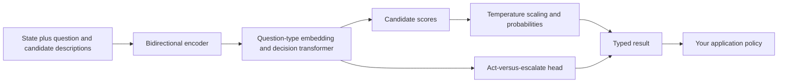

# Getting started with Laya on Ubuntu 24.04 and an RTX 2080

**Using, evaluating, and adapting the Convai Innovations decision model on 8 GB of VRAM**\
Prepared September 27, 2026.

## 1. First, identify the right Laya

The Laya in your PDF is **Convai Innovations’ non-autoregressive decision model**, maintained at [NandhaKishorM/laya](https://github.com/NandhaKishorM/laya). Its models are published under [convaiinnovations on Hugging Face](https://huggingface.co/convaiinnovations/laya), and its Python SDK is the [`laya` PyPI package](https://pypi.org/project/laya/).

The URL you supplied, [aayushch/laya](https://github.com/aayushch/laya), belongs to a separate desktop notification assistant using Python, Tauri, n8n, and local or cloud language models. Its documentation warns that `pip install laya` does not install that desktop application. For the **decision model discussed in your PDF**, however, `pip install laya` is the appropriate package. The identical names make this distinction easy to miss.

Your existing [smoke-test-laya.py](./smoke-test-laya.py) and [notebook](./smoke-test-laya.ipynb) use the decision-model SDK, so this guide continues that work.

### What this guide was checked against

- The complete supplied [Flowtivity PDF](./Laya_The_Open-Source_Jev_Alternative_Benchmarked_Honestly_Flowtivity.pdf), a 14-page printout of an article by AJ Awan dated September 21, 2026. It is a secondary analysis article, not an academic paper.
- The decision-model repository at commit **`4066d5d5fbf08b66c6757ddeedbd797bd7655bc0`**.
- SDK/PyPI version **0.3.20**.
- The combined Hugging Face model repository at revision **`55cf4c4ebb4ebe31b2550e8bdf3bd21b99753851`**, including root, `multilingual`, and `typed-decisions` checkpoint configurations.
- The published fine-tuning notebook and current inference/training source.

These pins describe the snapshot researched here. The PDF tested **0.3.4**, so newer SDK behavior may differ. In this guide, **reported** performance means a source’s result, **observed** means information inspected in your files or upstream code, and **proposed** means a recipe written for this guide.

**SDK compatibility correction:** The published PyPI 0.3.20 loader differs from the GitHub checkout with the same version string: `laya.load()` does not accept `revision` or `compile`, and `Router()` does not accept `revision`. The examples below pin downloads through `huggingface_hub.snapshot_download()` and then load local checkpoint directories. Version strings alone did not catch this difference in the original guide.

The code below uses Laya’s native decision architecture. It does not use a text-generation trainer. GPU performance and full-checkpoint training were not measured here: the tool environment could not access the NVIDIA driver. The training/calibration workflow was smoke-tested on a tiny local CPU checkpoint, which checks software mechanics rather than performance on your RTX 2080.

## 2. What Laya does

Laya takes a **state** and one or more **typed questions**. A state can be text, a JSON-like dictionary, or a conversation list. You define the allowed answers and their meaning. Laya scores them and returns structured results, instead of decoding a prose answer token by token.

Typical use cases include:

- Select a support queue from a small set of queues.
- Estimate whether a message contains a cancellation threat.
- Assign an ordinal severity score.
- Select a workflow route or identify whether a request needs review.
- Estimate a defined outcome, after training on appropriate labels.

It does not write a reply, produce a patch, or independently execute the chosen action. Your application owns those steps.

### The three question types

| Type | Input schema | Meaning of the output |
| --- | --- | --- |
| `choice` | A mapping of labels to descriptions | Selected label and a probability distribution over labels |
| `score` | An ordered list of rubric descriptions | Expected rubric index and a distribution over levels |
| `noul` | A yes/no proposition, optionally with false/true descriptions | Probability assigned to the proposition being true |

`noul` is the SDK’s literal name for its boolean question type. Do not substitute `bool` or `boolean` in the low-level question API.

The SDK supports schema-oriented helpers as well, but learn the explicit question API first: you need to understand label order, probability meaning, and rubric semantics before fine-tuning.

### A mental model for the architecture



The English model pairs ModernBERT-large with a small decision transformer, option scorer, and action head. The tokenizer inserts candidate markers; the scorer reads the corresponding hidden representations. Question type embeddings distinguish `choice`, `score`, and `noul`. See the pinned [architecture and sequence construction](https://github.com/NandhaKishorM/laya/blob/4066d5d5fbf08b66c6757ddeedbd797bd7655bc0/laya/common.py).

“One forward pass” means the questions can be batched into a forward invocation. It does **not** mean that adding questions is computationally free: the encoder receives a separate formatted sequence for each question. State tokenization can be reused, but state hidden representations are question-dependent.

## 3. Read the Flowtivity article with the right expectations

The article usefully separates base-model behavior from task-specific fine-tuning. Its headline typed-decision accuracy of **0.766** refers to a specialist trained on the benchmark’s training split; the base English checkpoint’s **0.362** is a different setting. The article gives a **0.461 majority-class baseline** for that evaluation. Do not budget your own application around the fine-tuned headline without a local evaluation.

Other article-reported results include:

| Reported figure | What you should infer |
| --- | --- |
| 32.8 ms for one question on a T4 | A benchmark reference; not a latency promise for your RTX 2080 |
| 72.3 ms total for ten questions | Batching amortizes overhead, but ten questions require more total work |
| ECE 0.081 after temperature refitting | Calibration was an additional operation, not an automatic property of the base weights |
| Poor performance on a 77-label choice task | Large candidate sets are a different challenge from a four-way routing question |
| 49.4-second warm median on the author’s small CPU VPS | Their measured environment; not evidence that all CPU deployments are that slow |
| No per-token hosting fee | You still pay in hardware, power, labels, maintenance, and opportunity cost |

Source: the supplied PDF, pp. 5–10. Its Jev comparisons mix self-measured Laya results with third-party Jev results; they are not a matched experiment on identical infrastructure.

### Important corrections and qualifications

**Structured outputs can still be wrong.** Avoiding prose generation prevents a class of formatting failures and free-form invented text. It does not prevent misclassification, incorrect probabilities, unsupported inferences, or bad downstream actions.

**Proper scoring rules do not guarantee deployment calibration.** Their mathematical motivation is to reward truthful probability reporting under an idealized expected objective. Finite data, optimization, teacher targets, distribution shift, and implementation details still matter.

**The 2025 routing paper is described inaccurately in the article’s history.** The supplied arXiv:2510.01237v1 is a multi-signal confidence-routing paper. It does not disclose Laya’s later typed-decision architecture or a complete RLCD training recipe. You can recognize conceptual continuity without treating the article’s priority narrative as proof of technical equivalence.

**Context limits have evolved.** The inspected checkpoint defaults remain 512 tokens for English and 1,024 for multilingual/specialist models. Current SDK documentation also describes an opt-in multilingual `max_len=8192` path. An increased accepted length is not a guarantee of long-document accuracy or an appropriate starting point for an 8 GB GPU.

## 4. What your RTX 2080 can reasonably do

Your RTX 2080 is a Turing GPU, compute capability **7.5**, with **8 GB VRAM**. It is a suitable machine for experimenting with one Laya checkpoint and adapting a relatively small decision head. Treat full-model fine-tuning as a later memory-engineering experiment.

### Start with this configuration

| Setting | Initial choice | Reason |
| --- | --- | --- |
| Checkpoint | English root, for English examples | Small input window; straightforward baseline |
| Loaded checkpoints | One | Leaves memory for activations and the desktop |
| Inference | Ordinary SDK path, `fast=False` | Establish correctness before introducing specialized kernels |
| Context | 256–512 tokens | Predictable memory and easy truncation inspection |
| Question count | One to three | Keeps effective encoder batch small |
| Training | Freeze encoder; train decision head | Greatly reduces gradients and optimizer state |
| Training precision in the first recipe | FP32 | A simple diagnostic baseline; no BF16 dependency |
| Later mixed precision | FP16 with a gradient scaler | Turing supports FP16; measure numerical behavior |

BF16 is not the appropriate hardware-accelerated default for the RTX 2080. The inspected SDK selects **FP16 autocast on CUDA devices below compute capability 8**, even if the checkpoint config says `amp_dtype: bf16`. Autocast changes operation precision; it does not by itself halve all persistent model weights.

Source: [NVIDIA Turing compatibility](https://docs.nvidia.com/cuda/turing-compatibility-guide/index.html) and the pinned [Laya device/precision implementation](https://github.com/NandhaKishorM/laya/blob/4066d5d5fbf08b66c6757ddeedbd797bd7655bc0/laya/agent.py).

### Approximate memory arithmetic

These are calculations, not measured peak usage:

- 421 million FP32 weights occupy roughly **1.68 GB / 1.57 GiB**.
- The same weights stored as FP16 occupy roughly **0.84 GB / 0.78 GiB**.
- Full FP32 Adam-style training can need roughly **16 bytes per trainable parameter** for parameters, gradients, and two optimizer moments: around **6.74 GB / 6.27 GiB** for 421M parameters, before activations and runtime overhead.
- With the encoder frozen, most of that trainable state belongs only to the approximately 26M-parameter added components. The proposed script prints the actual trainable count for your checkpoint.

GPU memory is shared with display use and other processes. System RAM also matters because loading/saving checkpoints creates host-side tensors and caches. About 16 GB system RAM and ample free disk space are sensible planning targets, not verified minimum requirements.

### Why your notebook ran out of memory

Your notebook contains two calls to `Router(preload=True)` and retains a live router variable. A later call constructs new models **before** the previous assignment releases its old router. IPython can retain additional references. Combined with preloading multiple checkpoints, this can create temporary or sustained duplicate residency.

Its captured error reports approximately **7.21 GiB in use** and about **30 MiB free**, followed by CPU fallback. It also records a clamped temperature warning. This is evidence from an earlier run, not a measurement of your machine’s current state.

For a clean retry:

1. Restart the notebook kernel so retained model references are released.
2. Inspect `nvidia-smi` in your regular terminal for other GPU processes.
3. Load one checkpoint once.
4. Check the actual selected device after loading and after prediction.

`torch.cuda.empty_cache()` releases unused cached allocations; it does not free tensors that a live model or notebook reference still owns.

## 5. Set up Ubuntu and verify GPU access

The commands in this section are instructions for **your regular Ubuntu terminal**. They were not executed to change your drivers or system packages during preparation of this guide.

### 5.1 Check the host before installing Python packages

```bash
nvidia-smi
python3 --version
```

On your Ubuntu 24.04 system, use a Python 3.10+ interpreter; Python 3.12 is a reasonable choice. If `nvidia-smi` fails on the host, resolve the driver first. Ubuntu documents the recommended-driver workflow:

```bash
ubuntu-drivers devices
sudo ubuntu-drivers install
```

Reboot if a driver was installed or replaced, then verify `nvidia-smi` again. If Secure Boot is enabled, complete any requested module-signing/key-enrollment step. Avoid installing a random driver version based only on the package commands below. See [Ubuntu’s NVIDIA driver guidance](https://documentation.ubuntu.com/server/how-to/graphics/install-nvidia-drivers/).

The inaccessible driver in the tool environment used to prepare this document does not establish that your host driver is broken.

### 5.2 Create a separate environment

From this project directory:

```bash
sudo apt update
sudo apt install python3-venv python3-pip git
python3 -m venv .venv-laya
source .venv-laya/bin/activate
python -m pip install --upgrade pip
```

Use this interpreter consistently in scripts and notebooks. Avoid installing into Ubuntu’s system Python.

### 5.3 Install a CUDA-capable PyTorch build

One explicit compatibility baseline for this older GPU is the published PyTorch 2.6.0 CUDA 12.4 wheel:

```bash
python -m pip install torch==2.6.0 --index-url https://download.pytorch.org/whl/cu124
python -m pip install "transformers==4.57.1" "laya==0.3.20" scipy
python -m pip check
python -m pip freeze > laya-environment.txt
```

These are **proposed pins**, not a complete stack tested here on an RTX 2080. The Laya source declares `torch>=2.0.0` and `transformers>=4.48.0`; the chosen Transformers release includes ModernBERT. PyTorch publishes the CUDA 12.4 wheel above in its [previous-version installation instructions](https://pytorch.org/get-started/previous-versions/).

For a conservative CUDA 12.4 driver pairing, use a compatible Linux driver at least as new as **550.54.14**, the corresponding toolkit-driver release. CUDA minor-version compatibility allows some older-driver cases, so this is a conservative pairing rather than the only legal minimum. See [NVIDIA CUDA 12.4 release notes](https://docs.nvidia.com/cuda/archive/12.4.0/cuda-toolkit-release-notes/index.html).

You normally do not need to install a full CUDA toolkit merely to run a prebuilt PyTorch wheel. The wheel supplies runtime dependencies; the host NVIDIA driver remains necessary. A compiler/toolkit becomes relevant if you build custom CUDA extensions.

If you keep an already working newer PyTorch installation, verify its support for `sm_75` and run the following checks rather than downgrading automatically. Do not assume the newest optional acceleration kernels support your GPU.

### 5.4 Verify the interpreter, CUDA, and a real operation

```python
import sys
import torch
import transformers
import laya

print("Python:", sys.executable)
print("Versions:", torch.__version__, transformers.__version__, laya.__version__)
print("Wheel CUDA:", torch.version.cuda)
print("CUDA available:", torch.cuda.is_available())
assert torch.cuda.is_available(), "Fix CUDA access before testing GPU inference"
print("GPU:", torch.cuda.get_device_name(0))
print("Capability:", torch.cuda.get_device_capability(0))
print("Compiled architectures:", torch.cuda.get_arch_list())
x = torch.randn(128, 128, device="cuda", dtype=torch.float16)
y = x @ x
torch.cuda.synchronize()
print("FP16 matrix result:", y.shape)
```

Save it as `check_laya_gpu.py` if desired and run it with `.venv-laya/bin/python`. If matrix multiplication works but model inference fails, distinguish unsupported model kernels, package incompatibility, and memory exhaustion.

For Jupyter:

```bash
python -m pip install ipykernel
python -m ipykernel install --user --name laya-2080 --display-name "Laya RTX 2080"
```

Select that kernel, then confirm `sys.executable` before loading a model.

## 6. Run your first controlled prediction

### 6.1 Load one pinned checkpoint

Save the following as `laya_first_prediction.py`. It replaces the memory-heavy preload pattern with a single English model:

```python
import json
import torch
import laya
from huggingface_hub import snapshot_download

checkpoint_dir = snapshot_download(
    "convaiinnovations/laya",
    revision="55cf4c4ebb4ebe31b2550e8bdf3bd21b99753851",
    allow_patterns=[
        "rl_agent_config.json", "model.safetensors", "tokenizer/*", "encoder/*",
    ],
)
agent = laya.load(checkpoint_dir, device="cuda", fast=False)
assert agent.device.type == "cuda", "SDK fell back to CPU; inspect its warning"
print("Loaded:", agent.device, "autocast:", agent.dtype)

questions = {
    "queue": {
        "type": "choice", "instructions": "Which queue should handle this ticket?",
        "criteria": {
            "billing": "charges, invoices, payments, or refunds",
            "technical": "bugs, outages, or product malfunction",
            "other": "neither billing nor technical",
        },
    },
    "urgency": {
        "type": "score", "instructions": "Rate operational urgency.",
        "criteria": ["routine", "time sensitive", "production blocked"],
    },
    "cancel_threat": {
        "type": "noul",
        "instructions": "Does the customer explicitly threaten to cancel?",
    },
}
state = "We were charged twice. Refund the duplicate today or we will cancel."
result = agent.predict(state, questions)
print(json.dumps(result, indent=2))
print("Device after prediction:", agent.device)
free, total = torch.cuda.mem_get_info()
print("Free/total GiB:", round(free / 2**30, 2), round(total / 2**30, 2))
```

Run `python laya_first_prediction.py`. The first run downloads checkpoint files. The typed output shape is reliable; the selected labels and numeric scores are predictions, not asserted example answers.

`revision` belongs to `snapshot_download` in this example. Its file filters download only the English root checkpoint. Loading the returned snapshot directory also works with the published SDK, without asking Laya to interpret a Hub revision.

The SDK supports both `agent.predict(...)` and `agent.system_one(...)` for a single state. The latter makes the typed-decision interface explicit.

### 6.2 Read the fields correctly

For a choice answer:

- `choice` is the highest-probability label.
- `probabilities` contains the distribution over allowed labels.
- `answer_confidence` is **max(probabilities)**.
- `confidence` is **1 − normalized entropy** for `choice` and `score` in the inspected SDK.

For `noul`, the `noul` field is **P(true)**. Both confidence fields are the larger of P(true) and P(false). If P(true) = 0.10, the model is making a confident **negative** prediction; it is not expressing 10% certainty.

For `score`, `score` is the expected index:

\[
\operatorname{score}=\sum_{j=0}^{K-1}j\,p_j.
\]

A three-level rubric therefore produces values between 0 and 2, potentially fractional. `answer_confidence` describes the most likely **discrete level**, not a confidence interval for the expected score.

The `action.act_probability` field comes from a separate trained head. It is not identical to max probability. The training recipe below leaves that head frozen, so you should not assume its output remains calibrated after adapting other components.

Source: the pinned [answer decoder](https://github.com/NandhaKishorM/laya/blob/4066d5d5fbf08b66c6757ddeedbd797bd7655bc0/laya/agent.py) and [confidence definitions](https://github.com/NandhaKishorM/laya/blob/4066d5d5fbf08b66c6757ddeedbd797bd7655bc0/laya/common.py). Even `answer_confidence` is a score requiring empirical calibration; the field name is not a guarantee.

### 6.3 Use Router when you actually need multiple checkpoints

For multilingual work:

```python
from laya import Router

router = Router(
    device="cuda", preload=False, max_loaded=1,
)
print(router.route("Please refund the duplicate charge."))
print(router.route("कृपया अतिरिक्त शुल्क वापस करें।"))
# route() inspects routing without loading or running a checkpoint.
```

With `max_loaded=1`, alternating languages can trigger eviction and reloading. This is a memory/latency tradeoff, not an ideal configuration for high-throughput interleaved traffic. Stay with a fixed `Agent` while learning or group requests by checkpoint.

The default router is mostly a **language/checkpoint selector**. It is not the four-path local/RAG/large-model/human policy from the earlier paper. Current automatic typed-workflow detection is opt-in; use `model="typed-decisions"` explicitly if you intend to select that checkpoint. Question IDs alone do not train a new task.

For an unpinned Hub load, use `laya.load("convaiinnovations/laya", subfolder="multilingual", device="cuda")`; for the specialist, use `subfolder="typed-decisions"`. Loading only one subfolder avoids downloading the other checkpoint weights. Use the explicit download below when you need the combined-repository revision pin.

For pinned subfolder loading with the published SDK, first download its files explicitly:

```python
from pathlib import Path
from huggingface_hub import snapshot_download
import laya

subfolder = "multilingual"  # or "typed-decisions"
snapshot = snapshot_download(
    "convaiinnovations/laya",
    revision="55cf4c4ebb4ebe31b2550e8bdf3bd21b99753851",
    allow_patterns=[f"{subfolder}/{name}" for name in (
        "rl_agent_config.json", "model.safetensors", "tokenizer/*", "encoder/*",
    )],
)
agent = laya.load(str(Path(snapshot) / subfolder), device="cuda")
```

The `Router()` example above demonstrates routing without loading weights; its default future checkpoint loads are not revision-pinned. For reproducible multi-checkpoint serving, supply downloaded local checkpoint directories in `Router(models={...})` or use a fixed local `Agent`.

## 7. Control token budgets and schema meaning

The inspected English checkpoint has `max_len=512` and `head_max_len=192`. The state does not receive all 512 tokens: the question, option descriptions, and special tokens also occupy that budget.

Laya formats roughly:

```text
[CLS] question type and instructions [SEP]
[MASK] option 0 [MASK] option 1 ... [SEP]
state tokens [SEP]
```

The sequence builder limits each option description and can further shorten descriptions when they collectively exceed the header budget. Consequently, “it accepted my 40 labels” does not mean it read every candidate description in full.

Practical starting rules:

- Use two to five options where possible.
- Give concise, distinct definitions that match how annotators label cases.
- Include `other` or `unknown` only when it has a defined meaning and examples.
- Keep important facts inside the retained state budget.
- Compare original text with the actual encoded/truncated input when investigating errors.
- Version the question schema along with the model: a wording change can alter predictions.

For ordinary strings/dictionaries, state truncation keeps the beginning by default. For conversation lists, the inspected inference path keeps recent material by truncating from the left. The proposed training code follows that list behavior so training and serving agree.

For many categories, consider hierarchical decisions or a candidate shortlist. Evaluate shortlist recall separately: if the true category is removed, the final decision model cannot recover it. Changing the candidate set also changes the probability denominator and may require recalibration.

The current multilingual long-input path is worth investigating later, after measuring actual memory and verifying that the complete question/header and state fit. Raising `max_len` is not an alternative to testing whether the needed evidence survives truncation.

## 8. Fine-tuning strategy for 8 GB VRAM

### 8.1 Use a staged approach

| Stage | What changes | Your initial use |
| --- | --- | --- |
| Schema and state design | No weights | Fix ambiguous labels and missing/truncated evidence |
| Temperature calibration | A few scalars | Adjust probability scale after measuring held-out behavior |
| Frozen encoder, trained decision head | Added transformer/type embedding/scorer | Recommended first training experiment |
| Selectively unfrozen encoder | Head plus some encoder layers | Later experiment if frozen features are insufficient |
| Encoder LoRA | Added adapters plus relevant heads | Possible engineering extension requiring native checkpoint integration |
| Full RLCD fine-tuning | Encoder/head adaptation with noisy-policy objective | Reproduce only after the supervised pipeline works |

Generic causal-LM SFT examples from the previous guide do not directly apply: Laya is a bidirectional encoder with custom decision heads. You train candidate scores against decision targets, not assistant text against next-token labels.

### 8.2 What the published notebook actually does

The inspected [Kaggle notebook](https://github.com/NandhaKishorM/laya/blob/4066d5d5fbf08b66c6757ddeedbd797bd7655bc0/notebooks/laya_finetune_typed_decisions_2xT4_kaggle.ipynb) starts from the English root checkpoint, preprocesses the training split of `LocalLLaMA/typed-decisions`, and launches distributed training on two T4 GPUs. It uses:

- Full encoder and head training, with different learning rates.
- Encoder and decision-head gradient checkpointing.
- FP16 autocast with gradient scaling.
- Noisy candidate-logit distributions evaluated using proper-score rewards.
- A group-relative reward baseline and a policy-gradient term.
- An additional **soft cross-entropy** term with coefficient 1.0.
- Post-training temperature fitting and native checkpoint export.

This is much more concrete than the 2025 SalesRLAgent paper’s unspecified training algorithm. However, benchmark improvement cannot be attributed to the policy-gradient term without an ablation against the soft-cross-entropy term alone.

Do not run the notebook unchanged on your single RTX 2080. Its microbatch, sequence length, calibration batch size, DDP assumptions, and Kaggle paths need adaptation. DDP replicates model and optimizer state per GPU; two 16 GB T4s do not provide a single model with an automatically pooled 32 GB memory budget.

The notebook’s calibration holdout is created at the **question-item level**. For your own data, split entire tickets/cases/accounts first, so another question from the same state cannot enter training while its sibling is in calibration.

### 8.3 Start with supervised decision-head adaptation

The following recipe is **proposed**, not the project’s official RLCD loop. It minimizes:

\[
\mathcal{L}=-\sum_jt_j\log p_j,
\]

where \(t\) is a target distribution over valid candidates. One-hot targets work for reviewed labels. Soft targets are useful when they have a defensible meaning; a teacher’s confidence is not necessarily an empirical probability.

Freeze the encoder and action head; adapt the decision transformer, question-type embeddings, and option scorer. This provides a useful supervised baseline and uses much less optimizer memory than full-model adaptation. Because the action head is frozen, gate decisions using separately evaluated answer probabilities rather than trusting `act_probability` after training.

## 9. Prepare domain data

Choose one initial task, such as support queue routing. Start with a few dozen examples to test mechanics, then expand to hundreds or thousands of reviewed domain examples according to learning curves. These counts are planning suggestions, not guarantees of accuracy.

Use four disjoint **case-level** sets:

| File | Purpose |
| --- | --- |
| `data/laya_train.jsonl` | Fit the trainable head |
| `data/laya_calibration.jsonl` | Fit temperatures |
| `data/laya_validation.jsonl` | Choose epochs, schema, and routing thresholds |
| `data/laya_test.jsonl` | Evaluate the frozen final configuration |

Do not split repeated questions, paraphrases, or ticket revisions independently. Keep related customer/account records together. For time-sensitive workloads, include a chronological test period.

### Native training-record format used by this guide

Each line is a JSON object like this fictional ticket:

```json
{"case_id":"ticket-001","schema_version":"triage-v1","state":"We were charged twice. Refund it today or we will cancel.","questions":{"queue":{"type":"choice","instructions":"Which queue should handle this ticket?","criteria":{"billing":"charges, invoices, payments, or refunds","technical":"bugs, outages, or product malfunction","other":"neither billing nor technical"}},"urgency":{"type":"score","instructions":"Rate operational urgency.","criteria":["routine","time sensitive","production blocked"]},"cancel_threat":{"type":"noul","instructions":"Does the customer explicitly threaten to cancel?"}},"targets":{"queue":[1,0,0],"urgency":[0,1,0],"cancel_threat":[0,1]}}
```

This is a guide-specific training schema, not an undocumented SDK API or the exact official benchmark format.

**Target order is critical:**

- `choice`: insertion order of the `criteria` keys.
- `score`: rubric order, starting at index 0.
- `noul`: **[false, true]**.

Targets must have one entry per valid candidate, all entries must be finite/nonnegative, and their sum must be 1. The code rejects malformed targets instead of silently converting them to a uniform distribution.

For a sales conversion task, define an outcome such as `purchase_within_30_days` and train a `noul` question on observed mature outcomes. Include only the prefix available at prediction time. An eventual purchase label is different from whether a salesperson sounded confident. See the [earlier paper guide](./salesrlagent-confidence-routing-fine-tuning-guide.md) for leakage and outcome-window handling.

## 10. A single-device training script

Save the block below as **`finetune_laya_head.py`**. The script intentionally starts with one question sequence per microbatch, gradient accumulation, FP32 computation, and frozen encoder parameters. It exports an ordinary Laya checkpoint.

It uses internal SDK helpers to preserve native preprocessing. Those helpers were inspected in 0.3.20; they are not a stable public training interface across future releases. Keep your package pin when using this example.

The scripts validate question/target shapes, but they assume you already created independent splits. They do not detect duplicated tickets, shared accounts, or paraphrase leakage for you.

```python
import argparse
import copy
import json
import random
from pathlib import Path

import numpy as np
import torch
import laya
from laya.agent import Agent
from laya.common import QTYPES, build_sequence, collate_items, render_options
from safetensors.torch import save_file
from huggingface_hub import snapshot_download

MODEL_REVISION = "55cf4c4ebb4ebe31b2550e8bdf3bd21b99753851"

def read_items(agent, filename):
    items = []
    with open(filename, encoding="utf-8") as handle:
        for line_number, line in enumerate(handle, 1):
            if not line.strip():
                continue
            row = json.loads(line)
            for qid, definition in row["questions"].items():
                Agent._check_question(qid, definition)
                q = Agent._to_internal(definition)
                options = render_options(q)
                target = np.asarray(row["targets"][qid], dtype=np.float32)
                if (target.shape != (len(options),) or
                    not np.isfinite(target).all() or (target < 0).any() or
                    not np.isclose(target.sum(), 1.0, atol=1e-5)):
                    raise ValueError(f"Invalid target on line {line_number}, {qid}")
                ids, markers = build_sequence(
                    agent.tok, row["state"], q,
                    agent.cfg["max_len"], agent.cfg["head_max_len"],
                    truncate_left=isinstance(row["state"], list),
                )
                if len(markers) != len(options):
                    raise ValueError(f"Options truncated on line {line_number}, {qid}")
                items.append({
                    "ids": ids, "markers": markers, "qtype": QTYPES[q["t"]],
                    "target": target.tolist(), "label": int(target.argmax()),
                    "case_id": row.get("case_id", str(line_number)), "qid": qid,
                })
    if not items:
        raise ValueError("Dataset contains no question items")
    return items

def model_inputs(batch, device):
    return {key: batch[key].to(device) for key in (
        "input_ids", "attention_mask", "marker_pos", "marker_mask", "qtype",
    )}

def save_checkpoint(agent, output):
    output = Path(output)
    output.mkdir(parents=True, exist_ok=True)
    weights = {key: value.detach().cpu().contiguous()
               for key, value in agent.model.state_dict().items()}
    save_file(weights, str(output / "model.safetensors"))
    agent.model.encoder.config.save_pretrained(output / "encoder")
    agent.tok.save_pretrained(output / "tokenizer")
    with open(output / "rl_agent_config.json", "w", encoding="utf-8") as handle:
        json.dump(agent.cfg, handle, indent=2)

def main():
    parser = argparse.ArgumentParser()
    parser.add_argument("--data", required=True)
    parser.add_argument("--output", required=True)
    parser.add_argument("--model", default="convaiinnovations/laya")
    parser.add_argument("--revision", default=MODEL_REVISION)
    parser.add_argument("--device", default="cuda")
    parser.add_argument("--epochs", type=int, default=2)
    parser.add_argument("--accumulation", type=int, default=16)
    parser.add_argument("--max-length", type=int, default=256)
    parser.add_argument("--learning-rate", type=float, default=1e-4)
    args = parser.parse_args()
    if args.accumulation < 1 or args.epochs < 1 or args.max_length < 32:
        raise ValueError("Invalid epoch, accumulation, or length setting")
    random.seed(42)
    np.random.seed(42)
    torch.manual_seed(42)
    model_path = args.model
    if not Path(model_path).is_dir():
        model_path = snapshot_download(
            args.model, revision=args.revision,
            allow_patterns=[
                "rl_agent_config.json", "model.safetensors", "tokenizer/*", "encoder/*",
            ],
        )
    agent = laya.load(model_path, device=args.device)
    if agent.device.type != torch.device(args.device).type:
        raise RuntimeError("Requested device unavailable; inspect SDK fallback")
    agent.cfg = copy.deepcopy(agent.cfg)
    agent.cfg["max_len"] = min(agent.cfg["max_len"], args.max_length)
    agent.cfg["temperature"] = [1.0, 1.0, 1.0]
    agent.cfg.pop("temperature_by_options", None)
    agent.cfg["fine_tuned"] = True
    agent.cfg["model_name"] = "laya-domain-head"
    agent.cfg["guide_training"] = {
        "objective": "soft_cross_entropy", "encoder_frozen": True,
        "epochs": args.epochs, "seed": 42, "source_revision": args.revision,
    }
    model = agent.model.float()
    for name, parameter in model.named_parameters():
        parameter.requires_grad_(
            not name.startswith("encoder.") and not name.startswith("act_head.")
        )
    model.head_checkpointing = True
    trainable = [p for p in model.parameters() if p.requires_grad]
    print("Trainable parameters:", sum(p.numel() for p in trainable))
    items = read_items(agent, args.data)
    optimizer = torch.optim.AdamW(
        trainable, lr=args.learning_rate, weight_decay=0.01,
    )
    for epoch in range(args.epochs):
        model.train()
        model.encoder.eval()
        model.act_head.eval()
        random.shuffle(items)
        total_loss = 0.0
        for start in range(0, len(items), args.accumulation):
            group = items[start:start + args.accumulation]
            optimizer.zero_grad(set_to_none=True)
            for item in group:
                batch = collate_items([[item]], agent.tok.pad_token_id)
                logits, _ = model(**model_inputs(batch, agent.device))
                target = batch["target"].to(agent.device)
                loss = -(target * logits.log_softmax(-1)).sum(-1).mean()
                if not torch.isfinite(loss):
                    raise RuntimeError("Nonfinite training loss")
                (loss / len(group)).backward()
                total_loss += float(loss.detach())
            torch.nn.utils.clip_grad_norm_(trainable, 1.0)
            optimizer.step()
        print(f"Epoch {epoch + 1}: mean loss {total_loss / len(items):.5f}")
    model.eval()
    save_checkpoint(agent, args.output)
    if agent.device.type == "cuda":
        print("Peak allocated GiB:", torch.cuda.max_memory_allocated() / 2**30)

if __name__ == "__main__":
    main()
```

Run from your project directory after preparing the data:

```bash
python finetune_laya_head.py \
  --data data/laya_train.jsonl \
  --output runs/laya-head-v1 \
  --max-length 256 --epochs 2 --accumulation 16
```

The effective batch is 16 **question sequences**, not 16 complete multi-question tickets. Several questions from one case contribute several items, so heavily annotated cases receive more weight. If that is undesirable, add per-case weighting in a later controlled experiment.

The script resets inherited temperatures and removes option-bucket overrides. **The resulting checkpoint is uncalibrated until you fit new temperatures.** It stores all model weights, not just trainable head weights, because the ordinary Laya loader expects a complete checkpoint.

```text
runs/laya-head-v1/
  model.safetensors
  rl_agent_config.json
  encoder/config.json
  tokenizer/...
```

You can load it with `laya.load("./runs/laya-head-v1", device="cuda")`. Training saves this directory only after all epochs complete successfully. Running the first-prediction example downloads a base model; it does not create this trained checkpoint. If `rl_agent_config.json` is missing, check that training finished and that calibration's `--model` matches training's `--output`.

### What the first run proves

On a small pilot, check that loss is finite, trainable parameters receive gradients, frozen encoder parameters stay unchanged, and the exported checkpoint reloads. Those checks prove the adaptation mechanism works; they do not establish useful domain accuracy. Evaluate on the validation set before deciding whether to collect more data or train longer.

The first recipe avoids FP16 training to keep numerical diagnosis simple. If FP32 exceeds memory, first reduce length and close other GPU users. Then consider FP16 autocast and a gradient scaler as a separate experiment. Enable encoder gradient checkpointing only when unfreezing encoder layers; a frozen encoder has no stored backward graph to checkpoint away.

## 11. Calibrate the adapted model

Temperature scaling maps candidate logits to probabilities:

\[
p_j(T)=\frac{\exp(z_j/T)}{\sum_k\exp(z_k/T)}.
\]

For positive scalar \(T\), this does not change the top candidate. It adjusts sharpness, so it can improve probability quality without fixing classification mistakes. Small \(T\) sharpens; large \(T\) softens.

The inspected SDK clamps temperatures to **[0.5, 5.0]**. The downloaded English config contains a `choice:11+` temperature near **0.10058**, which triggers a warning and is applied as 0.5. Your notebook captured that warning. Repeating a benchmark’s old confidence numbers under the clamped runtime would therefore be inappropriate.

The specialist subfolder also contains inherited option-bucket temperatures in the inspected revision. Those overrides take precedence over type-level temperatures. When refitting type-level temperatures, remove the old bucket map, or your new fit may never be used for those buckets. The current upstream notebook removes the map when exporting its new fit.

These are observations of the pinned configurations and SDK behavior, not a claim that every future release will share them. Record both raw and applied temperatures, and measure calibration again after SDK or checkpoint changes.

### A matching calibration and evaluation script

Save this as **`calibrate_laya_head.py`** beside `finetune_laya_head.py`. It uses the same record preprocessing, collects raw logits under the runtime’s serving precision, fits one bounded temperature per type, and writes only the local checkpoint configuration.

```python
import argparse
import json
from pathlib import Path

import numpy as np
import torch
import laya
from scipy.optimize import minimize_scalar
from scipy.special import logsumexp, softmax
from laya.common import QTYPE_NAMES, collate_items, ece_score
from finetune_laya_head import read_items

@torch.inference_mode()
def collect(agent, filename):
    rows = []
    for item in read_items(agent, filename):
        batch = collate_items([[item]], agent.tok.pad_token_id)
        logits, _ = agent._infer(batch)
        k = len(item["target"])
        rows.append((
            item["qtype"], logits[0, :k].float().cpu().numpy().astype(float),
            np.asarray(item["target"], dtype=float),
        ))
    return rows

def nll(rows, temperature):
    losses = []
    for _, logits, target in rows:
        z = logits / temperature
        losses.append(-float(target @ (z - logsumexp(z))))
    return float(np.mean(losses))

def report(rows, temperatures):
    correct, confidence, brier, losses = [], [], [], []
    for qt, logits, target in rows:
        p = softmax(logits / temperatures[qt])
        correct.append(float(p.argmax() == target.argmax()))
        confidence.append(float(p.max()))
        brier.append(float(np.square(p - target).sum()))
        losses.append(-float(target @ np.log(np.maximum(p, 1e-12))))
    return {
        "questions": len(rows), "top_label_accuracy": float(np.mean(correct)),
        "soft_target_nll": float(np.mean(losses)),
        "multiclass_brier_sum": float(np.mean(brier)),
        "ece_max_probability": ece_score(np.asarray(confidence), np.asarray(correct)),
    }

def main():
    parser = argparse.ArgumentParser()
    parser.add_argument("--model", required=True)
    parser.add_argument("--calibration", required=True)
    parser.add_argument("--evaluate", required=True)
    parser.add_argument("--device", default="cuda")
    args = parser.parse_args()
    model_dir = Path(args.model)
    if not (model_dir / "rl_agent_config.json").is_file():
        parser.error(
            f"No trained checkpoint found: {(model_dir / 'rl_agent_config.json').resolve()}\n"
            "Run finetune_laya_head.py to completion first, with --output set to "
            "the same directory as this command's --model. If training saved elsewhere, "
            "set --model to that output directory."
        )
    agent = laya.load(str(model_dir.resolve()), device=args.device)
    if agent.device.type != torch.device(args.device).type:
        raise RuntimeError("Requested device unavailable")
    rows = collect(agent, args.calibration)
    temperatures = [1.0, 1.0, 1.0]
    for qt in range(3):
        selected = [row for row in rows if row[0] == qt]
        if len(selected) < 20:
            print("Too few calibration items for", QTYPE_NAMES[qt], "; using T=1")
            continue
        fitted = minimize_scalar(
            lambda log_t: nll(selected, float(np.exp(log_t))),
            bounds=(np.log(0.5), np.log(5.0)), method="bounded",
        )
        if not fitted.success:
            raise RuntimeError("Temperature optimization failed")
        temperatures[qt] = float(np.exp(fitted.x))
    agent.cfg["temperature"] = temperatures
    agent.cfg.pop("temperature_by_options", None)
    agent.cfg["guide_calibration"] = {
        "method": "per_type_bounded_temperature", "items": len(rows),
        "runtime_dtype": str(agent.dtype), "device": str(agent.device),
    }
    with open(model_dir / "rl_agent_config.json", "w", encoding="utf-8") as handle:
        json.dump(agent.cfg, handle, indent=2)
    print("Temperatures:", temperatures)
    evaluation = collect(agent, args.evaluate)
    print("Evaluation:", json.dumps(report(evaluation, temperatures), indent=2))
    for qt in range(3):
        selected = [row for row in evaluation if row[0] == qt]
        if selected:
            print(QTYPE_NAMES[qt], report(selected, temperatures))

if __name__ == "__main__":
    main()
```

First fit and evaluate on the independent validation set:

```bash
python calibrate_laya_head.py \
  --model runs/laya-head-v1 \
  --calibration data/laya_calibration.jsonl \
  --evaluate data/laya_validation.jsonl
```

The 20-item cutoff is only a guard against fitting a scalar to almost no observations. It does not mean 20 items establish reliable calibration. Aim for sufficient independent calibration cases and report sample counts and uncertainty. A temperature near a bound is a reason to inspect the logits, labels, and data shift.

When model/schema/epoch/threshold choices are frozen, run the same script with the independent final test file for `--evaluate`. It fits temperatures only on `--calibration`, never on `--evaluate`. If you compare many variants against the test set, it stops being an untouched final test.

The script’s `collect` uses one question at a time. Match the serving dtype and input length, then also evaluate your real serving batch shape; kernel precision and batching can produce small differences. Treat any CPU fallback during calibration as a failed GPU run rather than mixing precision/device paths without recording it.

The reports compare `argmax(target)` with `argmax(prediction)` for top-label accuracy. For soft teacher targets, that measures agreement with the teacher’s leading option, not independently established factual truth. For `score`, also measure expected-score MAE and error by rubric level; the script’s generic top-label metric is only one view.

### Check that the checkpoint really uses the fit

In a fresh process:

```python
import laya

agent = laya.load("./runs/laya-head-v1", device="cuda")
print("Raw temperatures:", agent.temperature_raw)
print("Applied temperatures:", agent.temperature)
print("Bucket overrides:", agent.temperature_by_options)
```

The bucket map should be empty for this per-type recipe, and applied temperatures should match the fitted values. Re-run a few saved cases and compare raw versus calibrated probability quality on independent data.

## 12. Evaluate a decision model, not just a demo

### Minimum useful comparisons

Use the same questions and independent cases for:

1. A majority-class or base-rate predictor.
2. A transparent rules baseline.
3. The shipped English checkpoint, zero-shot.
4. The specialist checkpoint if its training domains resemble your task.
5. Your frozen-encoder fine-tune, with and without new calibration.

Optionally add an embeddings/logistic-regression baseline from the previous guide. If it matches Laya’s quality at lower cost for your narrow task, that is a useful finding.

### What to measure

| Aspect | Measurements |
| --- | --- |
| `choice` | Accuracy, macro-F1, confusion matrix, class recall |
| `noul` | Precision/recall, PR-AUC when positives are rare, Brier score, log loss |
| `score` | Expected-score MAE, discrete-level errors, severe ordinal mistakes |
| Calibration | Reliability plots, ECE with stated binning, sample counts, before/after NLL |
| Selective decisions | Error versus accepted coverage; rejected-case outcomes |
| Performance | Cold load, first predict, warm p50/p95, effective question batch, peak VRAM |
| Robustness | Rare labels, negation, multilingual text, truncation, reordered options, schema variants |

The calibration script’s multiclass Brier value sums squared errors over candidates. That convention differs from averages over candidates and from binary positive-class Brier scores; label the convention when comparing published numbers.

Temperature scaling is per type here. Real calibration may differ by question family, language, option count, and checkpoint. Add finer calibration only with enough independent cases per group.

### Select thresholds from observed error and coverage

For a candidate threshold, compute the fraction of cases you would automatically accept and the error rate within that fraction. Bootstrap **case/account groups**, not independent questions from the same case. Choose policy thresholds on validation data and assess them on the final test set.

For example, a proposed application policy might accept a queue suggestion only when calibrated `answer_confidence >= threshold`; otherwise it requests review. The threshold is a parameter selected from your evidence. It does not grant permission to deploy software, refund money, or perform another consequential action.

Do not reuse the previous paper’s 0.75/0.55/0.35 thresholds or a blog’s 0.85 threshold without measuring your own risk/coverage tradeoff. A confident wrong answer under language shift can defeat confidence-only gating entirely.

### Measure warm latency correctly

```python
import statistics
import time
import torch

# Assumes agent, state, and questions from the first-prediction example.
for _ in range(3):
    agent.predict(state, questions)
times = []
for _ in range(20):
    torch.cuda.synchronize()
    start = time.perf_counter()
    agent.predict(state, questions)
    torch.cuda.synchronize()
    times.append((time.perf_counter() - start) * 1000)
print("Warm median ms:", statistics.median(times))
print("Approximate warm p95 ms:", sorted(times)[18])
```

This is end-to-end SDK timing for one state and your question set, with downloads excluded. Twenty repetitions are a smoke benchmark, not a production tail-latency study. Check device/fallback logs, then use a larger representative workload for performance claims.

## 13. How Laya relates to the earlier papers

### SalesRLAgent: domain prediction becomes a typed decision

Both systems emphasize a small specialized decision component instead of using free-form generation for every question. SalesRLAgent uses conversation prefixes to estimate conversion, whereas Laya offers a broader schema interface that can express a conversion event as a `noul` question.

What transfers:

- Preserve only observable conversation history at prediction time.
- Train against real outcomes with a defined time window.
- Separate outcome probability from uncertainty about that estimate.
- Evaluate early, middle, and late prefixes independently.

What does not automatically transfer:

- The SalesRLAgent paper’s headline accuracy or sales uplift.
- Its unspecified RL recipe or its claimed confidence intervals.
- A causal policy for choosing the best next sales action.

Laya’s source includes `td_lambda_targets` for multi-turn targets, but availability of that helper does not mean the single-device recipe here uses it or that a trained conversion predictor is a validated sales-action policy.

### Confidence-aware routing: decisions support a response policy

The earlier routing paper combines semantic alignment, layer convergence, and a learned confidence head to choose local generation, RAG, a larger model, or human review. Laya’s architecture does not implement that exact three-signal formula.

You could train Laya to classify whether a request is answerable from supplied context or choose among response routes. You need route-specific labels or correctness outcomes under a fixed downstream model configuration. A generic question such as “Should this go to a larger model?” does not create reliable routing knowledge by itself.

Keep two routing layers separate:

| Layer | Purpose |
| --- | --- |
| Laya `Router` | Choose English/multilingual/specialist checkpoint |
| Your application route policy | Choose local answer, evidence retrieval, a tool, clarification, or review |

Laya’s language heuristic can prevent some gross checkpoint mismatches before inference. The application policy still needs evidence about which downstream mechanism solves each request. A stronger model is not guaranteed to improve every task.

### RLCD: the connection is a training objective, not a probability guarantee

The inspected `proper_reward` combines a log-score term, a spherical-score term, and an ordinal ranked-probability-score penalty for `score`. The training notebook samples noisy logit policies and uses relative reward to form a policy-gradient update, alongside soft cross-entropy.

Our first training script uses only the supervised soft-cross-entropy baseline. This makes it easier to establish whether the data and architecture can learn your task before introducing reward sampling, exploration noise, and additional optimization parameters.

Only after that baseline works should you adapt the native RLCD loop. Compare supervised-only and RLCD-plus-supervised variants under matched data, trainable parameters, compute budget, and held-out evaluation. Improvements are empirical questions.

For the detailed interpretation of both papers, keep the [earlier guide](./salesrlagent-confidence-routing-fine-tuning-guide.md) beside this one.

## 14. Moving beyond the first training recipe

### If the head-only model underfits

First inspect label consistency, class balance, truncation, and whether your schema contains enough evidence. Then consider unfreezing the last few encoder layers while keeping the rest frozen. Enumerate the actual parameter names before selecting them; do not assume a decoder-only LLM’s layer names apply to ModernBERT.

Use a lower encoder learning rate than the head, batch one, short inputs, FP16 with scaling if stable, and encoder/head checkpointing as appropriate. Measure peak memory on a short run before scheduling a long one. Full FP32 optimizer state for the entire encoder leaves very little room on your GPU.

### If you want LoRA

LoRA may reduce optimizer state for encoder adaptation, but Laya does not become a causal LLM. Inspect the encoder’s actual projection modules, insert compatible adapters, and keep the decision-head objective. A standard causal-LM `SFTTrainer` script is not a substitute.

Before inference, either merge supported adapters back into a complete native checkpoint or implement explicit adapter loading. The ordinary loader expects complete decision-model tensors and performs strict compatibility checks. An adapter-only directory will not load as an ordinary Laya checkpoint.

QLoRA is not required merely because your GPU has 8 GB. For this model family, freezing the encoder is a much simpler first memory reduction. Quantized encoder training introduces compatibility and numerical questions that should be measured separately.

### If you want the native RLCD recipe

Use the official notebook as the source of the objective, not the article’s prose. Adapt these details for your hardware:

- One process/device instead of two-GPU DDP, or `torchrun --nproc_per_node=1` if retaining its distributed scaffolding.
- Replace Kaggle paths with project paths.
- Begin with microbatch 1 and a short sequence budget.
- Split cases before creating question items.
- Reduce calibration/evaluation batches as well as training batches.
- Use FP16, not BF16, on the RTX 2080.
- Keep temperature fitting inside the runtime’s supported bounds and remove stale bucket overrides.
- Preserve a supervised-only control experiment.

There is no verified training-time estimate here for your GPU. The article’s four-hour story and the notebook’s timing comments refer to other environments and are not a budget for your local run.

## 15. A practical sequence for you

### First session: make inference predictable

Verify GPU access in your own terminal. Create the dedicated environment, restart the notebook kernel, run the single-checkpoint example, and save the exact package versions and complete output. Test a small set of English cases, including negation and missing information.

**Success criterion:** you know which model/device ran, what each field means, and whether truncation affected the input.

### Second session: define one task and its baseline

Choose a small label set and a written annotation rubric. Build independent case-level splits. Compare the base model with a majority-class and simple-rules baseline.

**Success criterion:** you can explain the model’s mistakes and identify whether training, input design, or calibration is the next useful step.

### Third session: train and reload the decision head

Exercise the script on a small pilot, record peak VRAM, and confirm exported checkpoint loading. Expand the reviewed training set, calibrate on independent cases, and evaluate on validation.

**Success criterion:** the adapted model improves the defined task on unseen cases, not just training loss.

### Fourth session: validate decisions under realistic use

Choose a threshold from validation risk/coverage, test the frozen configuration, and run in shadow mode alongside your existing decision process. Record errors, language selection, fallback, input lengths, and outcomes.

**Success criterion:** measured quality, memory, and latency justify your intended use. Then consider encoder adaptation or RLCD if a clear failure remains.

## 16. Troubleshooting reference

| Symptom | Likely check or next step |
| --- | --- |
| `nvidia-smi` fails on the host | Driver/module loading, Secure Boot, reboot after installation |
| `torch.cuda.is_available()` is false | Correct interpreter, CUDA wheel, host driver visibility |
| Unsupported GPU architecture/kernel | Verify `sm_75` or usable PTX support; use ordinary SDK kernels first |
| CUDA OOM while constructing Router | Restart kernel; avoid duplicate/preloaded checkpoints; inspect other GPU users |
| GPU requested but inference runs slowly | Inspect SDK CPU-fallback warnings and actual device |
| Temperature-clamping warning | Record affected bucket; treat scores as needing fresh calibration |
| `answer_confidence` differs from `confidence` | Expected for choice/score: max probability versus normalized entropy |
| Boolean probability seems inverted | Targets must be [false, true]; `noul` returns P(true) |
| Fine-tune reload fails | Check full weights, encoder config, tokenizer, and `rl_agent_config.json` |
| Calibration has no apparent effect | Remove inherited `temperature_by_options`; verify applied values |
| Good training performance, poor validation | Group leakage, overfitting, rare labels, domain shift, or inconsistent rubric |
| Long ticket is misclassified | Inspect question/header budget and retained state tokens |
| Head adaptation changes act probability behavior | Frozen action head saw changed features; validate it separately |

## 17. Sources and files to keep handy

### Supplied material and your workspace

1. [Flowtivity Laya article PDF](./Laya_The_Open-Source_Jev_Alternative_Benchmarked_Honestly_Flowtivity.pdf), read in full. Benchmark interpretation and limits are mainly on PDF pp. 5–10.
2. [Earlier paper and model-training guide](./salesrlagent-confidence-routing-fine-tuning-guide.md).
3. [Your existing smoke-test script](./smoke-test-laya.py) and [notebook](./smoke-test-laya.ipynb).

### Primary Laya sources

4. [Correct decision-model repository](https://github.com/NandhaKishorM/laya).
5. [Pinned SDK metadata](https://github.com/NandhaKishorM/laya/blob/4066d5d5fbf08b66c6757ddeedbd797bd7655bc0/pyproject.toml).
6. [Native model and preprocessing code](https://github.com/NandhaKishorM/laya/blob/4066d5d5fbf08b66c6757ddeedbd797bd7655bc0/laya/common.py).
7. [Loading, precision, confidence decoding, and prediction](https://github.com/NandhaKishorM/laya/blob/4066d5d5fbf08b66c6757ddeedbd797bd7655bc0/laya/agent.py).
8. [Checkpoint routing](https://github.com/NandhaKishorM/laya/blob/4066d5d5fbf08b66c6757ddeedbd797bd7655bc0/laya/router.py).
9. [Published two-T4 fine-tuning notebook](https://github.com/NandhaKishorM/laya/blob/4066d5d5fbf08b66c6757ddeedbd797bd7655bc0/notebooks/laya_finetune_typed_decisions_2xT4_kaggle.ipynb).
10. [Hugging Face checkpoint at the inspected revision](https://huggingface.co/convaiinnovations/laya/tree/55cf4c4ebb4ebe31b2550e8bdf3bd21b99753851).
11. [English checkpoint configuration](https://huggingface.co/convaiinnovations/laya/blob/55cf4c4ebb4ebe31b2550e8bdf3bd21b99753851/rl_agent_config.json).
12. [Specialist checkpoint configuration](https://huggingface.co/convaiinnovations/laya/blob/55cf4c4ebb4ebe31b2550e8bdf3bd21b99753851/typed-decisions/rl_agent_config.json).
13. [Multilingual checkpoint configuration](https://huggingface.co/convaiinnovations/laya/blob/55cf4c4ebb4ebe31b2550e8bdf3bd21b99753851/multilingual/rl_agent_config.json).
14. [Laya API documentation](https://nandhakishorm.github.io/laya/).
15. [The separate desktop project with the same name](https://github.com/aayushch/laya).

### Hardware and runtime references

16. [Ubuntu NVIDIA driver installation](https://documentation.ubuntu.com/server/how-to/graphics/install-nvidia-drivers/).
17. [PyTorch published wheel/version installation commands](https://pytorch.org/get-started/previous-versions/).
18. [NVIDIA CUDA 12.4 release notes](https://docs.nvidia.com/cuda/archive/12.4.0/cuda-toolkit-release-notes/index.html).
19. [NVIDIA Turing compatibility guide](https://docs.nvidia.com/cuda/turing-compatibility-guide/index.html).
20. [ModernBERT model documentation](https://huggingface.co/docs/transformers/model_doc/modernbert).

Your first useful result should be a complete loop: one loaded checkpoint, a defined schema, reviewed labels, native head training, independent calibration, and an honest held-out evaluation on your machine.

### Verification performed while preparing this guide

All Python blocks passed syntax checks; the JSON example and local-file links were checked. The two script blocks were exercised on a tiny, randomly initialized local ModernBERT/Laya checkpoint with synthetic records, using CPU execution. The check verified training, calibration, checkpoint loading, probability/output invariants, and malformed-target rejection. It also verified that encoder/action-head tensors stayed unchanged while the decision head and scorer changed.

That smoke test used the available environment’s PyTorch **2.11.0+cu130**, Transformers **5.17.0**, and Laya **0.3.20**, with the inspected source checkout. It does not validate the proposed older wheel pins, full pretrained checkpoint quality, RTX 2080 memory consumption, or GPU latency. Those remain measurements to perform locally.

After the loader compatibility correction, the first-prediction call was regression-checked against the installed PyPI function signature, with checkpoint download/model execution mocked. The revised training and calibration scripts were also rerun successfully on the tiny CPU checkpoint using the installed PyPI release directly. Future example checks should use the published installation as well as the source checkout; the shared version number concealed an API difference.

On September 27, 2026, the full pinned English checkpoint was trained for two epochs on the supplied synthetic training records using Scott's RTX 2080, then calibrated and evaluated successfully using the installed PyPI release. Peak PyTorch allocated GPU memory was 1.979 GiB; validation top-label accuracy was 59/72 (81.9%). This GPU run verifies the workflow in the installed environment, rather than the older proposed package pins. See [the saved run summary](runs/laya-head-v1/run-summary.md) for commands, temperatures, metrics, and limitations. The test split remains unused.
