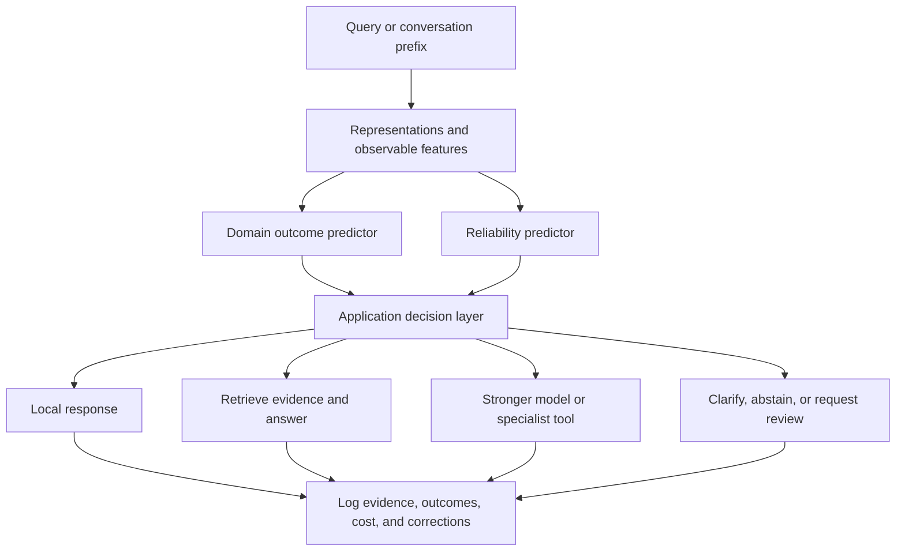

# From SalesRLAgent and confidence-aware routing to your own trained models

**A software engineer’s reading and implementation guide**\
Prepared September 27, 2026. Based on the two supplied **v1** PDFs, read in full, with supporting primary sources and official tooling documentation.

## How to use this guide

Read sections 1–5 to understand the papers and assess their significance. Use sections 6–10 to choose a project and start training. Sections 11–13 explain how to evaluate, troubleshoot, and sequence the work. Section 14 links the sources.

Throughout this guide:

- **Paper reports** means a statement or result appears in the supplied PDF; it has not been independently reproduced here.
- **Analysis** means an interpretation or methodological concern arising from the paper.
- **Proposed implementation** means an engineering approach supplied by this guide, rather than an implementation disclosed by the authors.

The code examples are starting points. They were checked for Python syntax; the small classifier example was also exercised on synthetic data. No neural-model training or reproduction of either paper was performed while preparing this document. Your task, data, hardware, and installed package versions will determine actual performance.

## 1. The main ideas and why they matter

These papers address two related questions:

1. **SalesRLAgent:** Can a specialized model follow a sales conversation and estimate whether it will end in a purchase?
2. **Confidence-aware routing:** Can a system estimate whether its language model is likely to answer correctly, then choose a more suitable response path when uncertainty is high?

The engineering connection is **prediction plus a decision layer**. A language model supplies representations or responses; a smaller trained component estimates an outcome or risk; orchestration decides what happens next.

Neither paper provides a complete, independently reproducible recipe for fine-tuning an entire LLM. SalesRLAgent describes training specialized prediction networks on pretrained embeddings. The routing paper describes training projection and confidence networks around a pretrained language model. It does not establish that its main language model was fine-tuned.

For your first project, build a measured baseline with a frozen model and a small classifier. Fine-tune the generator later if you identify a specific failure that requires changing its behavior. This lets you distinguish improvements from data, prediction, retrieval, routing, and language-model adaptation.

### The papers at a glance

| Dimension | SalesRLAgent | Confidence-aware routing |
| --- | --- | --- |
| Primary objective | Estimate sales conversion throughout a conversation | Estimate local-model reliability before generating an answer |
| Main input | Conversation prefix plus engineered features | Query and internal model activations |
| Main output | Conversion estimate and confidence; guidance in the broader system | Confidence score and one of four routes |
| Pretrained components | GPT-4O for synthetic data; Azure OpenAI embeddings | SmolLM2-360M-Instruct; all-MiniLM-L6-v2 reference embeddings |
| Trained components described | State encoder, policy/value networks, uncertainty module | Projection network and confidence predictor; score combination |
| Training data disclosed | More than 1.2 million synthetic conversations | 72 examples assigned to three confidence categories |
| Useful design lesson | Preserve conversation state and specialize the predictor | Spend more resources when predicted reliability is low |
| Main evidence concern | RL mechanics and evaluation protocol are insufficiently specified | Confidence validity, tiny disclosed training set, and benchmark protocol are insufficiently specified |

Source: [SalesRLAgent v1](./2503.23303v1-SalesRLAgent-A-Reinforcement-Learning-Approach-for-Real-Time-Sales-Conversion-Prediction-and-Optimization.pdf), §§III–VI; [confidence-aware routing v1](./2510.01237v1-Confidence-Aware-Routing-for-Large-Language-Model-Reliability-Enhancement.pdf), §§III–V. These local PDFs are the primary sources for the detailed discussion below.

## 2. The concepts you need before reading the methods

### 2.1 Embeddings are representations, not guarantees of truth

An embedding converts text into a vector:

\[
e = E(\text{text}) \in \mathbb{R}^{d}.
\]

Texts with similar meaning may have nearby vectors. A classifier can consume these vectors instead of raw tokens. Embeddings make useful features for a small predictor, but semantic similarity does not establish factual correctness, purchase intent, or causal impact.

For example, a question about a nonexistent API option can be very similar to legitimate documentation. Similarity can help locate evidence; it cannot substitute for checking whether the option exists.

### 2.2 Prediction, confidence, and action are different variables

In a sales system:

\[
p_t = P(Y=1\mid H_t),
\]

where \(Y\) means a conversion within a defined time window and \(H_t\) is the conversation history available at turn \(t\).

A separate uncertainty estimate asks how trustworthy \(p_t\) is. A conversion estimate of 0.5 can be appropriate and well supported for an ambiguous conversation. A prediction of 0.99 can be unreliable for an unfamiliar product or customer population.

In a routing system, define reliability against a fixed configuration:

\[
c(q) = P(\text{acceptable answer}\mid q,M,\text{prompt},\text{tools},\text{decoding}).
\]

The route is then an action based on that estimate. Changing the model, system prompt, retrieval source, or decoding policy changes the event being predicted and may require retraining or recalibration.

### 2.3 Supervised learning is sufficient for many sequential predictions

Supervised learning learns from input/target pairs. For sales, a pair can be `(conversation prefix, eventual conversion outcome)`. For reliability, it can be `(query features, observed answer correctness)`.

A conversation is sequential data, but that alone does not make its prediction problem reinforcement learning. A recurrent network, transformer, or even a prefix-based linear classifier can model sequential observations with supervised training.

Reinforcement learning becomes especially relevant when the model **chooses actions that influence future observations and rewards**: ask a question, recommend a demo, retrieve evidence, or escalate a request. Prediction and intervention need separate evaluation.

### 2.4 Calibration gives probabilities operational meaning

If predictions near 0.8 are calibrated, about 80% of those cases should satisfy the defined success event on comparable held-out data. Accuracy alone does not establish this property. Calibration methods fit a mapping from raw scores to probabilities on data separate from fitting the predictor. See [Guo et al., calibration](https://arxiv.org/abs/1706.04599) and [scikit-learn’s calibration documentation](https://scikit-learn.org/stable/modules/calibration.html).

Calibration can fail under distribution shift. A well-calibrated predictor for last quarter’s customers may become miscalibrated after a pricing change.

### 2.5 Fine-tuning has several distinct meanings

| Approach | What changes? | Suitable first use |
| --- | --- | --- |
| Frozen embeddings + classifier | Only a small prediction model | Conversion prediction or query reliability |
| Frozen LLM + activation probe | Only a head on internal activations | Test whether hidden states predict correctness |
| Encoder fine-tuning | Text encoder and classification head | Improve task-specific representation quality |
| Supervised fine-tuning, or SFT | Generator weights or adapters | Teach response format, evidence use, or domain workflow |
| Preference optimization | Generator adapted from preferred/rejected responses | Improve response choices when preference labels are reliable |
| RL policy learning | Policy optimized from rewards | Optimize sequential actions with defensible feedback |

You do not need to begin with the most complex row.

## 3. Paper one: SalesRLAgent

**Full title:** *SalesRLAgent: A Reinforcement Learning Approach for Real-Time Sales Conversion Prediction and Optimization*. Author: Nandakishor M. The supplied version is arXiv:2503.23303v1, March 30, 2025. [Version record](https://arxiv.org/abs/2503.23303v1).

### 3.1 What problem is it trying to solve?

The paper argues that answering sales questions is different from continuously forecasting a sale and offering timely guidance. Its proposed system tracks the conversation, estimates conversion probability after each turn, assesses confidence, and supplies guidance through existing sales tools.

**Analysis:** This is a useful separation of product responsibilities. A generative assistant can explain product capabilities while a predictor estimates conversion risk. However, the paper’s broad criticisms of RAG and LLM systems should not be treated as inherent technical limitations: those systems can also consume conversation history, invoke predictors, and maintain state.

### 3.2 Data generation and state representation

**Paper reports**, §§III.A–C, PDF p. 2:

- More than **1.2 million synthetic conversations**, generated with GPT-4O and multiple simulated agents.
- Scenarios across **15 industries**.
- Conversation lengths of **3–27 turns**, median **8 turns**.
- Approximately **56% non-converting** outcomes.
- Transcripts, speaker information, binary outcomes, per-turn conversion probabilities, simulated engagement metrics, and domain information.
- **3,072-dimensional Azure OpenAI embeddings**, combined with domain features.

The state includes history embeddings weighted by recency and importance, turn features, engagement signals, sales-technique indicators, and objection/interest detection. The paper does not give a complete formula for this state or a full model specification.

**Proposed implementation:** Represent each prefix as:

\[
s_t = [e(H_t); e(u_t); f_t],
\]

where \(e(H_t)\) represents history, \(e(u_t)\) the latest turn, and \(f_t\) contains features available at prediction time. Start with speaker, turn count, question count, and elapsed time if reliably logged. Sentiment and objection labels are themselves model outputs; measure whether they help rather than assuming they do.

Preserve speaker roles. “We cannot afford this” and “We can offer a payment plan” are different signals even if both concern affordability.

### 3.3 Architecture and training

**Paper reports**, §§IV.A–D, PDF p. 3, four components:

1. A state encoder.
2. A policy network that outputs conversion estimates.
3. A value network for expected cumulative reward.
4. A module described as meta-learning for prediction confidence.

The stated RL formulation makes the conversation prefix the state, the probability estimate the action, and prediction accuracy the reward. Training starts with supervised learning, followed by an unspecified specialized RL algorithm, curriculum learning, adversarial examples, and ensembles. The paper reports roughly **six hours on CPU infrastructure**, without enough hardware/model detail to estimate your own training time.

Algorithm 1 constructs history, embeddings, and features, evaluates the policy and value networks, estimates confidence, and returns probability and confidence. Its calculated value is not used in the returned output.

### 3.4 Why the RL claim needs scrutiny

**Analysis:** If the action is only a probability estimate and it does not affect the subsequent conversation, this formulation does not demonstrate a need for RL. Much of the task can be posed as ordinary supervised probabilistic forecasting.

A defensible baseline is binary cross-entropy:

\[
\mathcal{L}_{\mathrm{BCE}}
= -\sum_i\big[y_i\log p_i+(1-y_i)\log(1-p_i)\big].
\]

This is a **proposed baseline**, not the paper’s disclosed reward or loss. If every conversation supplies many prefixes, weight them so long conversations do not dominate simply by contributing more examples.

Rewarding only whether a thresholded prediction is correct can produce poor probability estimates. Proper scoring rules, such as log loss or Brier score, are better aligned with probability quality.

A separate sales policy could choose actions such as `ask_budget`, `clarify_objection`, or `offer_demo`. Those actions may influence a customer, making a sequential decision model meaningful. But you then need action logs, outcomes, and assumptions for estimating the consequences of actions. A model that predicts who will buy does not automatically know which intervention makes them buy.

### 3.5 Confidence and the meaning of “meta-learning”

The paper’s confidence module uses similarity to training conversations, ensemble consistency, familiar conversation structures, and detection of novel elements (§IV.C).

**Analysis:** These are plausible uncertainty features. The paper does not disclose a full task distribution, adaptation loop, meta-objective, or implementation establishing a conventional meta-learning method. Treat “meta-learning” here as the author’s description of the uncertainty component, rather than evidence that a specific algorithm such as MAML was implemented.

Likewise, the paper mentions confidence intervals but does not disclose enough about their construction or coverage to implement them faithfully. Ensemble disagreement is an uncertainty proxy; it is not automatically a statistically valid confidence interval.

### 3.6 Reported results

From §VI, Tables I–III, PDF pp. 4–5:

| Prediction system | Accuracy | ROC-AUC |
| --- | ---: | ---: |
| Random Forest | 0.67 | 0.71 |
| XGBoost | 0.69 | 0.74 |
| GPT-4, zero-shot | 0.59 | 0.63 |
| GPT-4, few-shot | 0.62 | 0.68 |
| Commercial System A | 0.71 | 0.76 |
| Commercial System B | 0.73 | 0.78 |
| Hybrid LLM + ML | 0.75 | 0.81 |
| SalesRLAgent, base | 0.92 | 0.94 |
| SalesRLAgent, full | 0.967 | 0.98 |

The difference between 96.7% and 62% is **34.7 percentage points**, not a 34.7% relative improvement. The relative accuracy increase is approximately 56%. Neither calculation establishes generalization to your data.

The latency table reports **85 ms and 12 requests/second** for SalesRLAgent on CPU, versus **3,450 ms** for GPT-4 through an API. The ablation table reports accuracy declining to 0.89 without Azure embeddings, 0.86 without sequential modeling, 0.94 without the confidence component, 0.92 without orchestration, and 0.95 without caching.

The deployment experiment reports random assignment of **217 representatives**, **12,433 conversations**, and **90 days**, with a **43.2% conversion-rate increase**, 22% shorter sales cycles, 14% higher average deal size, and 9% higher customer satisfaction.

These are **author-reported results**, not independently validated findings in this guide.

### 3.7 What the evidence leaves unresolved

| Missing or unclear detail | Why it affects interpretation |
| --- | --- |
| Exact RL algorithm, rewards, discounting, network sizes, and hyperparameters | Prevents faithful reproduction and attribution of gains to RL |
| Prediction-test size, split construction, and synthetic versus real composition | Prevents judging generalization and leakage risk |
| Per-turn evaluation versus end-of-conversation evaluation | A nearly completed sale is easier to classify than an early conversation |
| How synthetic per-turn probabilities were created and validated | Teacher scores can encode the generator’s assumptions rather than reality |
| Matched supervised sequential baseline | Needed to distinguish sequence modeling from benefits specifically caused by RL |
| Calibration metrics and interval coverage | Needed to interpret predicted probabilities and uncertainty |
| CPU specifications and latency boundaries | Embedding API calls and guidance generation may dominate end-to-end time |
| Raw A/B conversion rates, allocation details, uncertainty, and attrition | Needed to quantify business impact and statistical reliability |
| Why removing caching changes accuracy | A cache should preserve semantics; changes may reflect more than performance optimization |

Do not add ablation drops together: components can interact, and each row describes a separate experiment.

If the reported 43.2% uplift is relative, a hypothetical baseline of 10% would become 14.32%, an increase of 4.32 percentage points. The paper does not disclose baseline rates, so this is only an explanation of the arithmetic. With representatives as the randomization unit, uncertainty calculations should account for conversations clustered within representatives.

### 3.8 Practical significance

The strongest transferable ideas are to train a specialized predictor, keep a causal conversation prefix, measure uncertainty separately, and integrate it into a stateful workflow. The paper’s v1 disclosure is insufficient to conclude that its specific RL method caused the reported gains or that synthetic conversations alone are sufficient for real sales deployment.

## 4. Paper two: confidence-aware routing

**Full title:** *Confidence-Aware Routing for Large Language Model Reliability Enhancement: A Multi-Signal Approach to Pre-Generation Hallucination Mitigation*. Author: Nandakishor M. The supplied version is arXiv:2510.01237v1, September 23, 2025. [Version record](https://arxiv.org/abs/2510.01237v1).

### 4.1 The decision being predicted

The paper contrasts evaluating an already generated response with predicting failure from the query and model before answering (§III.A, PDF p. 2):

\[
P(\text{response is hallucinated}\mid r,q,M)
\quad\text{versus}\quad
P(M\text{ will hallucinate}\mid q,M).
\]

The estimate controls whether the system uses the local model, retrieval, a larger model, or human review.

**Analysis:** This is an application-level routing system. It is not a transformer mixture-of-experts layer that dispatches tokens among expert subnetworks.

Also, RAG is commonly performed **before** answer generation by retrieving context first; it is not intrinsically a post-generation correction technique. The original [RAG paper](https://arxiv.org/abs/2005.11401) provides that broader context. The interesting contribution here is deciding when to use a response mechanism based on a learned risk estimate.

### 4.2 Signal one: semantic alignment

The paper defines (§III.B, Equation 1):

\[
C_{\mathrm{sem}}
= \cos\big(P(h_{\mathrm{final}}),e_{\mathrm{ref}}\big).
\]

Here, \(h_{\mathrm{final}}\) is an internal representation, \(P\) is a learned projection into the reference embedding space, and \(e_{\mathrm{ref}}\) is an embedding from another model.

In software terms, the projection is an adapter between feature-vector types: it makes a local LLM representation comparable to a sentence-embedding representation.

**Analysis:** If the reference embedding represents the same query, high alignment shows agreement about the query’s representation, not proof that the LLM knows its answer. A good projection may align false-premise questions, unanswerable questions, and ordinary questions alike. The paper does not fully specify reference construction or token pooling; those choices must be declared in a reproduction.

### 4.3 Signal two: internal convergence

Equation 2 defines:

\[
C_{\mathrm{conv}}
= \frac{\operatorname{Var}(h_{1:L/2})}
{\operatorname{Var}(h_{L/2:L})+\epsilon}.
\]

The intuition is that reduced variation in later layers might indicate more settled processing.

**Analysis:** The variance axes, pooling, treatment of the midpoint, and normalization are not fully specified. Hidden states vary across layers, tokens, and dimensions; changing which axes are reduced changes the statistic.

There is also a mathematical range problem. This ratio is nonnegative but **unbounded**; a cosine lies in **[-1, 1]**. Neither is automatically a probability in [0, 1]. Consequently, their weighted sum does not establish the paper’s claimed [0, 1] confidence range without additional transformations or constraints.

A model can also converge on an incorrect belief. Stability is a feature worth testing, not a correctness guarantee.

### 4.4 Signal three: a learned confidence head

Equation 3 defines:

\[
C_{\mathrm{learned}}=\phi(h_{\mathrm{final}}).
\]

The paper describes a four-layer predictor with dimensionality reduction, batch normalization, and dropout. It reports AdamW with learning rate **2 × 10⁻⁴**, weight decay **10⁻⁴**, and learning-rate reduction on plateaus (§IV.B).

**Analysis:** This head needs trustworthy labels. Assigning high confidence to “technical” questions and low confidence to “personal” questions can train a topic classifier. It does not establish that the head predicts whether the fixed model will actually answer correctly.

For your own system, generate answers offline under a frozen configuration, judge them against evidence, and train the head to predict observed success or failure.

### 4.5 Combining signals and routing

Equations 4–5 combine the signals:

\[
C = w_1C_{\mathrm{sem}}+w_2C_{\mathrm{conv}}+w_3C_{\mathrm{learned}}.
\]

The disclosed thresholds (§IV.C, PDF p. 3) are:

| Confidence | Route |
| --- | --- |
| \(C\geq0.75\) | Local generation |
| \(0.55\leq C<0.75\) | RAG |
| \(0.35\leq C<0.55\) | Larger model |
| \(C<0.35\) | Human review |

These are the paper’s chosen values, not universal calibration constants. No learned weights are supplied, and threshold optimization is not documented sufficiently to repeat exactly.

**Proposed implementation:** Treat raw signals as features and fit a logistic classifier:

\[
\widehat{P}(\text{correct})
=\sigma\big(b+\beta_1s_{\mathrm{sem}}
+\beta_2\log(1+r_{\mathrm{conv}})+\beta_3s_{\mathrm{probe}}\big).
\]

Standardize features using training data only, then calibrate the classifier on held-out data. This bounds the score, but probability meaning still depends on labels and empirical calibration. If a probe score becomes an input to another predictor, generate training scores out of fold to avoid optimistic leakage.

### 4.6 What “before generation” costs

Hidden states require running the query through the model. For an autoregressive LLM, this is the **prefill** pass, which processes prompt tokens before producing answer tokens.

Thus pre-generation routing can avoid answer decoding, but it does not avoid local-model computation altogether. If the query is routed elsewhere, the probe pass may be additional work. If local generation is chosen, reusing the same prefill cache can reduce duplicated work, but cache integration is a serving-system task and is not shown in the paper.

Extracting all layers can increase memory use. A practical experiment should compare a query-embedding classifier, a final-layer probe, and the full multi-signal method before committing to all-layer extraction.

### 4.7 Training data and reported results

**Paper reports**, §IV.C, PDF p. 3:

- **72 training examples**: 33 high-confidence, 27 low-confidence, 12 medium-confidence.
- High-confidence examples include factual and technical questions; low-confidence examples include personal and temporal queries; medium-confidence examples include subjective queries.
- **30 epochs** and a combined semantic-alignment, confidence-MSE, and L2 loss.
- Final total training loss **0.1633**.

The paper names Natural Questions, TriviaQA, and HotpotQA and synthetic error-containing evaluation sets. It does not disclose benchmark sample counts, detailed splits, or enough answer-judging information to reproduce the results.

Table I reports:

| Method | Hallucination detection | False-positive rate | F1 | Relative cost |
| --- | ---: | ---: | ---: | ---: |
| Baseline | 0.42 | 0.15 | 0.61 | 1.0× |
| SelfCheckGPT | 0.68 | 0.12 | 0.76 | 4.2× |
| Always RAG | 0.71 | 0.08 | 0.80 | 2.8× |
| Proposed routing | 0.74 | 0.09 | 0.82 | 1.6× |

Table II reports signal-only F1 values of **0.76** for semantic alignment, **0.69** for convergence, **0.72** for learned confidence, and **0.82** for the combination.

### 4.8 How to interpret the numbers critically

1. **The 40% saving depends on the comparator.** From Table I, 1.6× costs about 42.9% less than always RAG at 2.8×, and about 61.9% less than SelfCheckGPT at 4.2×. It costs 60% more than the 1.0× baseline. The prose’s approximate 40% reduction is not tied to a fully specified cost accounting protocol.
2. **The detection/F1 relationship needs clarification.** The paper defines detection rate as the fraction of hallucinations detected, which normally corresponds to positive-class recall. If recall is 0.74, even perfect precision gives a maximum F1 of \(2(1)(0.74)/(1+0.74)\approx0.851\), so the 0.82 row is possible. However, the baseline’s recall of 0.42 limits that same F1 definition to about **0.592**, below its reported **0.61**. Different averaging conventions or tasks could explain this, but are not specified. Table II gives combined recall 0.80, whereas Table I gives detection 0.74; they should not be assumed to be the same evaluation setting.
3. **A 72-example training disclosure supports only limited conclusions.** A multilayer head can memorize broad query categories. No detailed independent split or uncertainty estimate is supplied to establish generalization.
4. **Loss convergence is not calibration.** A final training loss cannot substitute for held-out correctness, reliability curves, or domain-shift testing.
5. **Routing does not guarantee an answer’s truth.** A larger model or retrieved passage can also be wrong. Human review needs available evidence and an actual operational process.
6. **Routing quality and hallucination detection are separate outcomes.** A detector can rank local-model risk well while choosing a route that fails to improve the answer.

These issues limit the strength of the empirical claims. They do not establish that the design is useless or that results were fabricated.

### 4.9 Practical significance

The strongest idea is to predict model-specific failure risk and allocate resources accordingly. The supplied v1 does not establish that embedding agreement and hidden-layer convergence reliably predict truth across domains. Test those features against simpler classifiers and retain them only if they improve held-out performance and system cost.

## 5. Putting the ideas together

For a domain assistant, the two papers suggest complementary predictors:



This is a **proposed synthesis**, not an architecture jointly evaluated by the papers. In a sales assistant, the domain predictor estimates conversion while the reliability predictor estimates whether a proposed guidance mechanism is appropriate. They should not share a single ambiguous “confidence” field.

A useful interface separates fields:

```json
{
  "prediction_target": "purchase_within_30_days",
  "conversion_probability": 0.41,
  "prediction_out_of_distribution": false,
  "local_answer_correctness_probability": 0.63,
  "route": "retrieve",
  "predictor_version": "sales-prefix-v1",
  "router_version": "qa-router-v1"
}
```

These values are illustrative. An out-of-distribution flag also needs a measured decision rule; it is not an objective truth about a request.

For routing, failure type may matter more than one scalar. Missing company policy calls for retrieval; arithmetic may call for a calculator; unclear intent calls for clarification; unavailable personal information may require authenticated context or abstention. A larger model cannot recover facts absent from all available sources.

## 6. Choose your first project and define the data

### 6.1 Recommended first project: a technical-documentation assistant

For a software engineer without a sales-outcome dataset, a documentation QA router is a practical starting point. Use a bounded set of documents you understand, a local generator, and questions with verifiable answers.

Start with a few hundred carefully reviewed questions as a **pilot**, not as a statistically justified universal minimum. Include ordinary questions, rare details, questions requiring several documents, outdated assumptions, false premises, and questions the available evidence cannot answer. Increase the dataset based on learning curves and uncertainty in the evaluation.

Freeze the local model’s configuration, generate its answers offline, and record correctness. Begin with an embedding classifier predicting whether local generation will succeed. Only then test hidden-state features.

### 6.2 Reliability-record schema

```json
{
  "query_id": "q-0042",
  "group_id": "connection-pooling-topic-7",
  "query": "Does version 2.1 support option pool_idle_limit?",
  "model_id": "your-fixed-local-model",
  "model_revision": "immutable-revision-id",
  "prompt_version": "qa-v1",
  "decoding": {"do_sample": false, "max_new_tokens": 128},
  "reference_document_ids": ["client-manual-v2.1"],
  "generated_answer": "The option is supported.",
  "correct": 0,
  "error_type": "invented_configuration_option",
  "judging_method": "manual_review_against_versioned_manual",
  "split": "train"
}
```

This is a fictional example. Documents used to judge the answer are label evidence; they must not become runtime features unless the deployed system actually retrieves them before routing.

Define “correct” explicitly. For a strict technical QA pilot, require the answer to address the question, make no material unsupported claims, and correctly identify unavailable information. Keep a separate `abstained` field: a truthful refusal may be acceptable, but does not count as a resolved request. Report both reliability and task resolution.

For deterministic decoding, labels describe that fixed output policy. For sampled generation, repeat some queries to estimate how much outcomes vary. A query-only predictor estimates conditional risk; it cannot identify every error in a future randomly sampled answer.

Do not use the generated answer itself as an input to a predictor claimed to operate before generation. You may use it offline to produce labels.

### 6.3 Sales-record schema

If you have appropriate historical sales data, use records like:

```json
{
  "conversation_id": "c-0017",
  "account_group_id": "account-008",
  "prediction_time": "2026-01-15T10:04:00Z",
  "turn_index": 4,
  "history": [
    {"speaker": "customer", "text": "Can it connect to our CRM?"},
    {"speaker": "representative", "text": "Which CRM are you using?"}
  ],
  "target": "purchase_within_30_days",
  "converted_within_window": 0,
  "outcome_observed": true,
  "split": "train"
}
```

The `history` array is shortened for illustration. Every feature must reflect information available at `prediction_time`. Do not include a later CRM status, final transcript, signed contract, or synthetic outcome annotation in the input.

Define the outcome window and handling of unresolved opportunities. A lead with only five days of follow-up cannot simply be labeled as failing to purchase within 30 days. Wait for outcome maturity, omit such records from that binary experiment, or use a survival-analysis formulation.

For several prefixes per conversation, keep every prefix in the same split. Split related conversations by account, and consider representative or organization holdouts if those reflect deployment. Evaluate forecasts at fixed early/middle/late stages so near-outcome turns do not conceal poor early forecasting.

### 6.4 Split data before deriving examples

Use four logically separate sets:

| Set | Purpose |
| --- | --- |
| Training | Fit the predictor or adapter |
| Calibration | Fit the probability mapping |
| Validation | Choose features, hyperparameters, and route thresholds |
| Test | Assess the final frozen configuration |

Exact proportions depend on dataset size. For small datasets, grouped cross-validation can use data more efficiently, but calibration and threshold selection must still avoid the final test set.

Keep paraphrases, source entities, conversations, customer accounts, and synthetic-template families from leaking across splits. Add a chronological holdout when facts or customer behavior change over time.

For a generator and router built from the same data, beware of another leakage path: a generator can memorize its SFT examples, making correctness on those examples artificially high. Train the router on independent queries or out-of-fold generator outputs. Calibrate it against the final generator on queries the generator did not train on.

### 6.5 Synthetic data: useful support with limits

Synthetic examples can exercise the pipeline and cover unusual cases. To avoid reproducing the teacher’s shortcuts:

1. Define scenario factors such as objection type, product complexity, and evidence availability.
2. Generate varied wording and order, including hard negatives and ambiguous cases.
3. Store hidden scenario metadata separately from model-visible inputs.
4. Split by scenario/template family before producing derivatives.
5. Inspect whether outcomes correlate with superficial wording, transcript length, or teacher labels.
6. Evaluate final performance on independent real or carefully evidence-verified examples.

A teacher-generated “0.85 probability of conversion” is not a measured purchase probability. If you train against it, label the experiment as imitation or distillation, and measure against actual outcomes before using the result operationally.

## 7. A small calibrated predictor you can train first

This **proposed implementation** works for either task:

- Sales: `X` contains prefix embeddings/features and `y=1` means conversion.
- Routing: `X` contains query embeddings or pre-generation features and `y=1` means an acceptable local-model answer.

Start with frozen vectors. The [all-MiniLM-L6-v2 model card](https://huggingface.co/sentence-transformers/all-MiniLM-L6-v2) documents a 384-dimensional sentence representation and default truncation for long inputs. For lengthy conversations, explicitly choose recent-turn truncation or turn-level pooling; do not silently assume the whole transcript was encoded.

For example:

```python
from sentence_transformers import SentenceTransformer

encoder = SentenceTransformer("sentence-transformers/all-MiniLM-L6-v2")
texts = ["Customer: Can this connect to our CRM?", "Explain connection pooling."]
X = encoder.encode(texts, normalize_embeddings=True)
print(X.shape)  # (2, 384)
```

Cache vectors by text hash, encoder revision, and preprocessing version. If the encoder changes, re-encode the data and retrain downstream predictors.

### 7.1 Input contract

Create `features.npz` with arrays `X_train`, `y_train`, `X_cal`, `y_cal`, `X_val`, `y_val`, `X_test`, and `y_test`. Each `X` has shape `[examples, features]`; each `y` is a binary vector. Both classes must be present in every evaluation split. Build these arrays **after** the grouped split, rather than randomly splitting all prefixes.

Use one representative prefix per conversation in the first sales baseline. When adding multiple prefixes, introduce per-conversation sample weights and report conversation-level as well as prefix-level metrics.

### 7.2 Train, calibrate, save, and evaluate

Save the following block as `train_predictor.py` when you are ready to run your own experiment. It implements a sigmoid calibration layer using a second logistic regression on frozen decision scores. This explicit form avoids relying on a changing calibration-wrapper API.

```python
import joblib
import numpy as np
from sklearn.linear_model import LogisticRegression
from sklearn.metrics import (
    average_precision_score, brier_score_loss, log_loss, roc_auc_score,
)
from sklearn.pipeline import make_pipeline
from sklearn.preprocessing import StandardScaler

data = np.load("features.npz", allow_pickle=False)
for split in ("train", "cal", "val", "test"):
    X, y = data[f"X_{split}"], data[f"y_{split}"]
    assert X.ndim == 2 and y.shape == (len(X),)
    assert np.isfinite(X).all()
    assert set(np.unique(y)) == {0, 1}

predictor = make_pipeline(
    StandardScaler(), LogisticRegression(max_iter=2000, C=1.0),
)
predictor.fit(data["X_train"], data["y_train"])

# Fit only the calibration layer on independent calibration examples.
cal_scores = predictor.decision_function(data["X_cal"]).reshape(-1, 1)
calibrator = LogisticRegression(C=1e6, max_iter=2000)
calibrator.fit(cal_scores, data["y_cal"])

def probabilities(X):
    scores = predictor.decision_function(X).reshape(-1, 1)
    return calibrator.predict_proba(scores)[:, 1]

def report(split):
    y = data[f"y_{split}"]
    p = probabilities(data[f"X_{split}"])
    return {
        "roc_auc": roc_auc_score(y, p),
        "average_precision": average_precision_score(y, p),
        "brier": brier_score_loss(y, p),
        "log_loss": log_loss(y, p),
    }

print("validation:", report("val"))
# Inspect test results only after freezing all experimental choices.
print("test:", report("test"))
joblib.dump(
    {"predictor": predictor, "calibrator": calibrator}, "predictor.joblib",
)
```

In a new virtual environment, install `numpy scikit-learn joblib`; add `sentence-transformers` if generating embeddings. Execute `python train_predictor.py` from the directory containing the feature archive. Store the feature schema and package versions alongside the saved model.

This code does not create your labels, enforce group independence, or guarantee calibration. Inspect a held-out reliability diagram and compare raw versus calibrated scores. With little calibration data, even sigmoid calibration can be unstable. The general held-out calibration workflow is described in [scikit-learn’s guide](https://scikit-learn.org/stable/modules/calibration.html).

### 7.3 Turning correctness scores into routes

An implementation of the paper’s thresholds is simple:

```python
def paper_route(correctness_probability):
    c = float(correctness_probability)
    if not 0.0 <= c <= 1.0:
        raise ValueError("Expected a finite probability in [0, 1]")
    if c >= 0.75:
        return "local"
    if c >= 0.55:
        return "rag"
    if c >= 0.35:
        return "large"
    return "human"
```

Use this to understand the rule, not to assume these thresholds meet your reliability requirements. A calibrated 0.75 score implies roughly 25% failure among comparable cases at that score. A threshold suitable for a demonstration may be far too permissive for your application.

Collect validation outcomes for each feasible route, then choose thresholds using actual quality and cost. Report how many requests each route receives, how many are resolved correctly, and how long they take. If routes were chosen by a previous policy, you only observe their outcomes; estimating other routes requires additional offline runs or appropriately designed exploration.

## 8. Experiment with the routing paper’s hidden-state signals

Do this after the embedding predictor works. You need local model weights or a runtime that exposes hidden activations. A text-only API generally does not provide the internal layer states required by this paper.

### 8.1 Extract pre-generation features

The following block loads the same model family named in the paper and returns one final-layer vector plus one convergence feature per query. It uses the decoder backbone directly, avoiding unnecessary vocabulary logits.

**Declared implementation choices:** mean-pool non-padding tokens, omit the embedding-output layer, and compute variance **across layers separately for each hidden coordinate**, then average coordinates. Use disjoint early/late layer halves. These are choices made here because the paper leaves them unspecified; this is not an exact reproduction of Equation 2.

```python
import torch
from transformers import AutoModelForCausalLM, AutoTokenizer

MODEL = "HuggingFaceTB/SmolLM2-360M-Instruct"
tokenizer = AutoTokenizer.from_pretrained(MODEL)
if tokenizer.pad_token_id is None:
    tokenizer.pad_token = tokenizer.eos_token
lm = AutoModelForCausalLM.from_pretrained(MODEL)
device = torch.device("cuda" if torch.cuda.is_available() else "cpu")
lm.to(device).eval()

@torch.inference_mode()
def pre_generation_features(queries):
    prompts = [tokenizer.apply_chat_template(
        [{"role": "user", "content": q}],
        tokenize=False, add_generation_prompt=True,
    ) for q in queries]
    batch = tokenizer(
        prompts, return_tensors="pt", padding=True,
        truncation=True, max_length=512, add_special_tokens=False,
    ).to(device)
    outputs = lm.model(
        **batch, output_hidden_states=True, use_cache=False,
        return_dict=True,
    )
    mask = batch["attention_mask"].unsqueeze(-1).float()
    pooled = torch.stack([
        (h.float() * mask).sum(1) / mask.sum(1).clamp_min(1)
        for h in outputs.hidden_states[1:]
    ], dim=1)  # [batch, layers, hidden_size]
    midpoint = pooled.shape[1] // 2
    early = pooled[:, :midpoint].var(1, unbiased=False).mean(-1)
    late = pooled[:, midpoint:].var(1, unbiased=False).mean(-1)
    log_ratio = torch.log1p(early / (late + 1e-6))
    return pooled[:, -1].cpu().numpy(), log_ratio.cpu().numpy()
```

Hidden-state outputs include an embedding output followed by layer outputs; see [Transformers model-output documentation](https://huggingface.co/docs/transformers/en/main_classes/output). The backbone accessor `lm.model` is specific to this model architecture. Other architectures may expose a different attribute.

The 512-token limit is an experiment setting; log truncation and test whether it removes necessary query context. Full hidden-state extraction remains memory-intensive even if the returned vectors are small. Measure peak memory, prefill latency, and throughput.

### 8.2 Train the probe before training the projection

Use the final-layer vectors as `X` in section 7 with correctness labels. Compare:

| Experiment | Features |
| --- | --- |
| A | Query embedding only |
| B | Final-layer vector only |
| C | Final-layer vector plus log convergence ratio |
| D | Projection alignment plus convergence plus a learned confidence score |

For D, fit a projection into the reference model’s 384-dimensional space and a confidence head. A possible **proposed** objective is:

\[
\mathcal{L}
=\lambda_{a}\big(1-\cos(P(h),E(q))\big)
+\lambda_{c}\operatorname{BCEWithLogits}(g(h),y)
+\lambda_{r}\lVert\theta\rVert_2^2.
\]

This differs from the paper’s described confidence-MSE objective. It uses actual binary correctness labels. Neither the \(\lambda\) values nor architecture choices are provided as established defaults here: choose them on validation data.

Train the alignment branch only on training queries, keep the reference encoder frozen, and use out-of-fold confidence-head scores when training another layer on those scores. Test whether alignment still predicts correctness after controlling for query topic. If it helps only distinguish “personal” from “technical” wording, it may fail on unfamiliar technical facts.

After adapting or quantizing the generator, re-extract activations and reassess the probe. The feature distribution and error behavior may have changed.

## 9. Start fine-tuning a generator with LoRA

Use this branch when the generator has a concrete behavioral problem: it ignores provided evidence, uses the wrong response format, fails to ask for missing information, or handles your domain workflow poorly. For changing facts, keep a versioned retrieval source rather than relying only on information stored in model weights.

### 9.1 SFT and LoRA in plain terms

SFT trains the model to produce target responses from examples. LoRA freezes the original weight matrix and trains a low-rank update:

\[
W' = W + \frac{\alpha}{r}BA,
\]

where \(A\in\mathbb{R}^{r\times k}\), \(B\in\mathbb{R}^{d\times r}\), and \(r\) is much smaller than the matrix dimensions. This reduces trainable parameters; it does not remove the need for activations during backpropagation. See the [LoRA paper](https://arxiv.org/abs/2106.09685).

QLoRA additionally stores the frozen backbone in a quantized form, commonly 4-bit, while learning adapters. It reduces memory pressure; it is not the same as training all backbone weights in 4-bit precision. See the [QLoRA paper](https://arxiv.org/abs/2305.14314).

### 9.2 Build evidence-grounded examples

Use conversational prompt/completion JSONL. Each line is a JSON object such as:

```json
{"prompt":[{"role":"system","content":"Answer from the supplied documentation. If evidence is missing, say what is missing."},{"role":"user","content":"Documentation: retry_count controls the maximum retries after a request fails.\nQuestion: What does retry_count control?"}],"completion":[{"role":"assistant","content":"It controls the maximum number of retries after a request fails."}]}
```

Include examples where the right response is an answer, a clarification, or a precise explanation of missing evidence. Include plausible false premises and conflicting/version-specific documents. Have a person review examples where factual accuracy matters to your use case.

Do not train indiscriminate refusal. Track answerable and unanswerable requests separately. Teach the model to explain evidence gaps, then evaluate whether it still resolves well-supported questions.

Prepare `data/sft_train.jsonl` and `data/sft_valid.jsonl` using the grouped split rules above. Keep a final `data/sft_test.jsonl` for separate task evaluation. Strip record metadata from trainer inputs if it is not part of `prompt` or `completion`.

### 9.3 Minimal LoRA training script

The example below uses SmolLM2-360M-Instruct because it matches the routing paper and is small enough for a learning experiment. This is a model-selection choice for understanding the paper, not a claim that it is the best production model. Consult its [model card](https://huggingface.co/HuggingFaceTB/SmolLM2-360M-Instruct) for intended use and limitations.

Create an isolated environment:

```bash
python -m venv .venv-training
source .venv-training/bin/activate
python -m pip install torch transformers datasets accelerate peft trl
python -m pip freeze > training-environment.txt
```

Use a PyTorch build compatible with your GPU/runtime. The official documentation checked for this guide uses `SFTConfig.max_length`, `processing_class`, and conversational prompt/completion datasets; completion-only loss is supported. See [TRL SFTTrainer](https://huggingface.co/docs/trl/en/sft_trainer). Package APIs evolve: capture exact versions after installation and retain them with the run.

Save this as `train_lora.py`:

```python
import torch
from datasets import load_dataset
from peft import LoraConfig
from transformers import AutoTokenizer
from trl import SFTConfig, SFTTrainer

MODEL = "HuggingFaceTB/SmolLM2-360M-Instruct"
cuda = torch.cuda.is_available()
bf16 = cuda and torch.cuda.is_bf16_supported()
dtype = torch.bfloat16 if bf16 else (torch.float16 if cuda else torch.float32)
tokenizer = AutoTokenizer.from_pretrained(MODEL)
if tokenizer.pad_token_id is None:
    tokenizer.pad_token = tokenizer.eos_token
data = load_dataset("json", data_files={
    "train": "data/sft_train.jsonl", "validation": "data/sft_valid.jsonl",
})
config = SFTConfig(
    output_dir="runs/smol-lora", max_length=512,
    per_device_train_batch_size=1, per_device_eval_batch_size=1,
    gradient_accumulation_steps=16, num_train_epochs=2,
    learning_rate=1e-4, warmup_ratio=0.05,
    bf16=bf16, fp16=cuda and not bf16,
    completion_only_loss=True, packing=False,
    eval_strategy="epoch", save_strategy="epoch",
    logging_steps=10, report_to="none", seed=42,
    model_init_kwargs={"dtype": dtype},
)
trainer = SFTTrainer(
    model=MODEL, processing_class=tokenizer, args=config,
    train_dataset=data["train"], eval_dataset=data["validation"],
    peft_config=LoraConfig(
        task_type="CAUSAL_LM", r=8, lora_alpha=16,
        lora_dropout=0.05, target_modules=["q_proj", "v_proj"],
    ),
)
trainer.train()
trainer.save_model("runs/smol-lora/final")
tokenizer.save_pretrained("runs/smol-lora/final")
```

Run `python train_lora.py`. The settings are conservative **proposed starting choices**, not tuned values from either paper. Inspect the model’s named modules before changing `target_modules`; `q_proj` and `v_proj` are architecture-specific names. PEFT documents configuration and target selection in its [LoRA reference](https://huggingface.co/docs/peft/en/developer_guides/lora).

Before a full run, inspect a tokenized example: prompt positions should be masked out of loss, completion tokens should remain, and truncation must not remove the desired response. Run a short smoke experiment on a few reviewed examples, then train the larger pilot. A lower validation token loss is useful diagnostic evidence, but still evaluate factual answers separately.

The effective batch in this single-device example is 16 sequences per optimizer update. Tokens per update depend on sequence lengths. Change learning rate or accumulation based on learning curves, not merely to imitate the paper’s epochs.

### 9.4 Load the adapter and generate

The saved LoRA directory is an adapter artifact that depends on the original backbone. Load both:

```python
import torch
from peft import PeftModel
from transformers import AutoModelForCausalLM, AutoTokenizer

adapter = "runs/smol-lora/final"
base = "HuggingFaceTB/SmolLM2-360M-Instruct"
tokenizer = AutoTokenizer.from_pretrained(adapter)
model = PeftModel.from_pretrained(
    AutoModelForCausalLM.from_pretrained(base), adapter,
)
device = torch.device("cuda" if torch.cuda.is_available() else "cpu")
model.to(device).eval()
messages = [
    {"role": "system", "content": "Answer from the supplied documentation. If evidence is missing, say what is missing."},
    {"role": "user", "content": "Documentation: retry_count controls maximum retries. Question: What does it control?"},
]
prompt = tokenizer.apply_chat_template(
    messages, tokenize=False, add_generation_prompt=True,
)
inputs = tokenizer(prompt, return_tensors="pt", add_special_tokens=False).to(device)
with torch.inference_mode():
    output = model.generate(**inputs, do_sample=False, max_new_tokens=128)
print(tokenizer.decode(
    output[0, inputs["input_ids"].shape[1]:], skip_special_tokens=True,
))
```

Record an immutable base-model revision for both training and inference. Compare adapted and unadapted models under identical prompts, retrieval context, and decoding settings. Rebuild correctness labels and recalibrate the router after changing the generator.

### 9.5 When to consider QLoRA

If a larger backbone exceeds memory limits, use a supported quantization runtime. In the Transformers/bitsandbytes workflow, the relevant ingredients are `BitsAndBytesConfig(load_in_4bit=True, bnb_4bit_quant_type="nf4", ...)`, an appropriate compute dtype, `prepare_model_for_kbit_training`, and LoRA adapters. Check current hardware support and avoid `device_map="auto"` for training; the official guide distinguishes training from inference usage. See [Transformers bitsandbytes documentation](https://huggingface.co/docs/transformers/en/quantization/bitsandbytes).

Do not start by combining quantization, all-layer probes, custom losses, and RL. Introduce one change at a time so the results remain interpretable.

### 9.6 Resource planning without false precision

The following are calculations and planning heuristics, not measured hardware recommendations:

- A 360-million-parameter backbone needs roughly **0.72 GB** for 16-bit weights alone, or **1.44 GB** for 32-bit weights. Runtime overhead and training activations add memory.
- A 7-billion-parameter backbone needs roughly **14 GB** for 16-bit weights alone. Raw 4-bit storage would be about **3.5 GB**, before quantization metadata and other training memory.
- Full fine-tuning also stores gradients and optimizer state; LoRA reduces trainable state but still backpropagates through the backbone to adapters.
- CPU is suitable for the small classifier. CPU neural training can exercise the workflow but may be slow. Measure a short run before choosing longer training.
- Sequence length, batch size, attention implementation, precision, and gradient checkpointing materially affect peak memory.

Measure examples/second, tokens/second, and peak memory on your own setup. The SalesRLAgent CPU timing does not establish a budget for LLM fine-tuning.

## 10. Where reinforcement learning and preference tuning belong

### 10.1 A practical ordering

For a QA assistant, use this sequence:

1. Establish the base model’s task accuracy and error types.
2. Add a verified retrieval source if missing evidence is a major cause of errors.
3. Train a simple correctness predictor and measure selective answering.
4. Use SFT/LoRA for a demonstrated behavioral failure.
5. Consider preference tuning only when you have meaningful preferred/rejected responses.
6. Consider sequential RL only when actions and delayed outcomes justify it.

Direct Preference Optimization learns from chosen and rejected responses without the same explicit reward-model/online-RL pipeline used in conventional RLHF. It can teach response preferences, but weak preferences such as “more confident sounds better” can worsen factual behavior. Prefer evidence-supported responses over unsupported ones, and judge factual reliability separately. See the [DPO paper](https://arxiv.org/abs/2305.18290).

### 10.2 A genuine sales decision problem

If your policy recommends the next action, define:

- **State:** conversation prefix, observed account context, and available product evidence.
- **Actions:** a bounded, reviewable set of next steps.
- **Transition:** the customer’s subsequent response and updated context.
- **Reward:** a defined outcome, potentially adjusted for discount cost, customer satisfaction, and long-term value.
- **Episode:** a conversation or account journey with an explicit stopping rule.

A possible objective is:

\[
J(\pi)=\mathbb{E}_{\pi}\left[\sum_{t=0}^{T}\gamma^t r_t\right].
\]

This is a standard RL framing provided here; it is not the missing SalesRLAgent reward definition. Avoid rewarding the policy for increasing its **own predicted** conversion probability: it can exploit flaws in the predictor without increasing actual purchases.

With historical logs, many alternative actions are unobserved. Offline policy evaluation needs adequate action coverage and assumptions about confounding; a simulator supplies only the simulator’s behavior. A GPT-generated customer population is useful for testing mechanics, but its preferences may differ substantially from real customers.

Start with action prediction or a contextual bandit only if that abstraction fits the outcome timing. Establish a supervised baseline, then evaluate business impact through a suitably designed experiment rather than equating classifier accuracy with improved sales.

### 10.3 Routing can also be a learned decision policy

The best route is not necessarily determined by local-model correctness alone. Let \(a\) be a response route. A more informative policy estimates route-specific failure risk and chooses:

\[
a^*(q)=\arg\min_a\left[
\lambda_f\widehat{P}(\text{failure}\mid q,a)
+\lambda_c\operatorname{cost}(q,a)
+\lambda_l\operatorname{latency}(q,a)
\right].
\]

This is a **proposed extension**, and the weights express your application’s priorities. Include human-review queue delay and unresolved-request handling. Routes are not guaranteed to form an ordered ladder of improving quality: retrieval may help a small model more than a larger model without evidence.

## 11. Evaluate the components and the whole system

### 11.1 Prediction metrics

| Metric | What it tells you | Main limitation |
| --- | --- | --- |
| Accuracy | Fraction of correct binary decisions | Can conceal class imbalance and poor probabilities |
| ROC-AUC | Positive/negative ranking across thresholds | May appear strong even when rare positives are hard to find |
| Average precision / PR curve | Positive-class retrieval quality | Depends on positive prevalence; specify the positive class |
| Log loss | Quality of probabilistic forecasts; strongly penalizes confident errors | Sensitive to very confident mistakes |
| Brier score | Mean squared probability error | Reflects both calibration and discrimination |
| Reliability diagram | Empirical success frequency versus confidence | Bin choice and sample count affect apparent calibration |
| ECE | A binned summary of calibration error | Not a guarantee, and values depend on binning |

The Brier score is:

\[
\operatorname{Brier}=\frac{1}{N}\sum_i(p_i-y_i)^2.
\]

Compare against a constant probability equal to the training base rate, not only against a large model. For sales, evaluate each prediction stage separately and include a time-based test. For routing, define hallucination, factual error, unsupported claim, and failure to resolve: these categories overlap but are not identical.

### 11.2 Selective answering metrics

For a local-answer threshold \(\tau\):

\[
\operatorname{Coverage}(\tau)
=\frac{1}{N}\sum_i\mathbf{1}[c_i\geq\tau],
\]

\[
\operatorname{Risk}(\tau)
=\frac{\sum_i\mathbf{1}[c_i\geq\tau]\mathbf{1}[y_i=0]}
{\sum_i\mathbf{1}[c_i\geq\tau]}.
\]

Risk is undefined if the system answers nothing. Plot risk against coverage and label the number of accepted cases. A system that routes every request away from the local model should not be described as excellent at answering without reporting that loss of coverage.

If your target is, for example, at most 5% observed local-answer error, choose a threshold on validation data and check it on the test set with uncertainty intervals. That is an example operational target, not a recommendation derived from either paper. A small accepted sample cannot establish a tight reliability claim; zero errors in 20 cases is weak evidence.

Bootstrap independent query groups or customer accounts when observations are related. For a representative-randomized sales experiment, account for the representative clustering. For multiple generated answers per query, do not count them as independent queries.

### 11.3 System-level measurements

Log and compare:

- Correctly resolved requests divided by all requests.
- Unsupported-claim rate among emitted answers.
- Appropriate abstentions, inappropriate abstentions, and unresolved requests.
- Route distribution and correctness within each route.
- Cost per request and per correctly resolved request.
- p50 and p95 end-to-end latency, including embedding, prefill, retrieval, generation, and queues.
- Retrieval failures, stale evidence, and route execution failures.

A useful cost model is:

\[
\mathbb{E}[\text{cost}]
=c_{\mathrm{assessment}}+
\sum_aP(A=a)\,\mathbb{E}[c_a\mid A=a].
\]

Define whether assessment computation is reused by generation. Do not compare a small classifier’s forward-pass latency with an API’s complete generated answer and call them equivalent workloads. Also state whether costs include human effort.

### 11.4 The experiment matrix

Use the same independent test set and judge rubric throughout:

| Variant | Question it answers |
| --- | --- |
| Always local | What happens without routing? |
| Always RAG | Does evidence improve outcomes enough to justify its cost? |
| Always stronger model | Is routing better than uniform escalation? |
| Simple rules based on evidence availability | Can a transparent baseline solve most of the problem? |
| Embedding predictor + routing | Is a small classifier sufficient? |
| Final-layer probe + routing | Do internal activations add value? |
| Full multi-signal routing | Do all proposed signals justify their overhead? |
| LoRA model under each relevant route | Does adapting generation improve the actual task? |

For a sales project, compare a base-rate forecast, metadata-only classifier, embeddings-only classifier, supervised sequential model, and any proposed RL method. Keep embedding availability, prediction time, and evaluation data matched.

### 11.5 Error analysis that leads to a useful change

After each run, inspect a manageable sample of confident errors and unnecessary escalations. Record the cause: missing source evidence, poor retrieval, incorrect reasoning, false premise, truncated input, version mismatch, mislabeled reference, or unfamiliar domain.

Match the intervention to the cause. Better retrieval addresses missing evidence; SFT may improve evidence-use behavior; a tool can address deterministic computation; revised labels address judging errors. Training longer will not repair every failure type.

## 12. Common pitfalls and how to recognize them

| Symptom | Likely issue | Next check |
| --- | --- | --- |
| Excellent synthetic accuracy, poor real accuracy | Generator artifacts or domain shift | Hold out template families and test on independent real cases |
| Very high sales accuracy on late turns | Outcome becomes explicit in the input | Evaluate early prefixes and inspect future-information leakage |
| Predictor always says “high confidence” for technical questions | It learned topic familiarity | Include rare, false-premise, and unanswerable technical questions |
| High cosine alignment, wrong answer | Semantic representation mistaken for factual evidence | Compare against a correctness-trained baseline |
| Confidence leaves [0, 1] | Unnormalized cosine/variance combination | Use a fitted bounded mapping and calibrate it |
| Low training loss, unreliable probability | Overfitting or invalid confidence labels | Inspect held-out labels and reliability curves |
| LoRA loss falls but task accuracy declines | Label quality, response masking, overtraining, or format mismatch | Inspect tokenized examples and actual generated answers |
| Large increase in refusals | Dataset rewards abstention too broadly | Separate answerable/unanswerable accuracy and task resolution |
| Router saves decoding but increases latency | Expensive assessment and duplicated prefill | Profile the complete serving path and consider cheaper features |
| Probe works before fine-tuning and fails after | Changed activations and error behavior | Re-extract features and refit/recalibrate |
| A caching ablation changes outputs | Cache-key or versioning differences | Verify cached and uncached computation uses identical inputs and versions |

When moving a prototype into use, keep the data practices tied to the application: minimize identifiers in sales transcripts, use authorized document access, and log the evidence behind corrections. A “human” route should have an actual owner and a fallback when nobody is available.

## 13. A milestone-based learning plan

### Milestone 1: establish a trustworthy task

Choose documentation QA or sales prediction. Write the prediction target, input availability, success rubric, and grouped split policy. Review a small set of records manually and create a base-rate or always-local baseline.

**Deliverable:** a versioned dataset, rubric, and baseline result you can explain without using the papers’ headline numbers.

### Milestone 2: train a small predictor

Create frozen embeddings, train section 7’s classifier, calibrate it, and examine held-out errors. For routing, plot risk versus coverage. For sales, compare early and later prefixes.

**Deliverable:** predictor artifact, feature schema, calibration report, and error examples.

### Milestone 3: test system decisions

Run local, retrieval, and stronger-model routes offline on shared validation queries. Choose thresholds from observed outcomes and cost. Freeze the configuration, then evaluate it once on the final test set.

**Deliverable:** a quality/cost/latency comparison showing whether routing actually helps.

### Milestone 4: fine-tune one behavior

Build reviewed SFT examples for one failure category, run the LoRA smoke experiment, then train the pilot. Compare against the base model on the independent task test set, including unrelated capabilities you need to preserve.

**Deliverable:** adapter, base-model revision, training configuration, package lock, and before/after task results.

### Milestone 5: test the papers’ more ambitious ideas

Add final-layer probes, convergence features, and projection alignment one at a time. Consider a decision-learning formulation only after you have action/outcome evidence. Keep an addition only when repeated independent evaluation shows a useful improvement.

**Deliverable:** an ablation report establishing which ideas transferred to your task and which did not.

### Suggested experiment directory

```text
experiments/
  data/                  # Versioned manifests and split-specific datasets
  features/              # Cached vectors and preprocessing metadata
  scripts/               # Feature extraction, training, evaluation
  runs/                  # Configurations, checkpoints, adapters
  reports/               # Metrics, plots, reviewed errors
  training-environment.txt
```

Record seeds, dataset hashes, source-document versions, model revisions, prompts, decoding settings, calibration parameters, and route thresholds. This makes an improved result attributable to a specific change rather than a collection of undocumented differences.

## 14. Sources and further reading

The detailed paper summaries refer to the supplied v1 PDFs, including their methods, tables, limitations, and references. Online version records confirm their identities. Supplemental sources explain established methods and current tool interfaces; they do not validate the two papers’ experimental claims.

### Supplied papers

1. Nandakishor M. **SalesRLAgent: A Reinforcement Learning Approach for Real-Time Sales Conversion Prediction and Optimization**. arXiv:2503.23303v1, 2025. [Local PDF](./2503.23303v1-SalesRLAgent-A-Reinforcement-Learning-Approach-for-Real-Time-Sales-Conversion-Prediction-and-Optimization.pdf) · [Version record](https://arxiv.org/abs/2503.23303v1). Read §§III–IV for modeling and §§VI–VII for results and limitations.
2. Nandakishor M. **Confidence-Aware Routing for Large Language Model Reliability Enhancement: A Multi-Signal Approach to Pre-Generation Hallucination Mitigation**. arXiv:2510.01237v1, 2025. [Local PDF](./2510.01237v1-Confidence-Aware-Routing-for-Large-Language-Model-Reliability-Enhancement.pdf) · [Version record](https://arxiv.org/abs/2510.01237v1). Read §III for equations, §IV.C for the 72-example training disclosure, and §V for result tables.

### Foundational methods

3. Hu et al. **LoRA: Low-Rank Adaptation of Large Language Models**. [Paper](https://arxiv.org/abs/2106.09685). Read for parameter-efficient adaptation.
4. Dettmers et al. **QLoRA: Efficient Finetuning of Quantized LLMs**. [Paper](https://arxiv.org/abs/2305.14314). Read when quantized-backbone adaptation becomes necessary.
5. Guo et al. **On Calibration of Modern Neural Networks**. [Paper](https://arxiv.org/abs/1706.04599). Read to distinguish predictive accuracy from probability calibration.
6. Lewis et al. **Retrieval-Augmented Generation for Knowledge-Intensive NLP Tasks**. [Paper](https://arxiv.org/abs/2005.11401). Read for evidence retrieval coupled with generation.
7. Rafailov et al. **Direct Preference Optimization: Your Language Model is Secretly a Reward Model**. [Paper](https://arxiv.org/abs/2305.18290). Read after obtaining reliable preference pairs.
8. Manakul et al. **SelfCheckGPT: Zero-Resource Black-Box Hallucination Detection for Generative Large Language Models**. [Paper](https://arxiv.org/abs/2303.08896). Read to understand the sampling-based comparator named in the routing paper.

### Models and implementation documentation

9. [SmolLM2-360M-Instruct model card](https://huggingface.co/HuggingFaceTB/SmolLM2-360M-Instruct).
10. [all-MiniLM-L6-v2 model card](https://huggingface.co/sentence-transformers/all-MiniLM-L6-v2).
11. [TRL SFTTrainer](https://huggingface.co/docs/trl/en/sft_trainer).
12. [PEFT LoRA configuration](https://huggingface.co/docs/peft/en/developer_guides/lora).
13. [Transformers bitsandbytes quantization](https://huggingface.co/docs/transformers/en/quantization/bitsandbytes).
14. [Transformers model outputs](https://huggingface.co/docs/transformers/en/main_classes/output).
15. [scikit-learn probability calibration](https://scikit-learn.org/stable/modules/calibration.html).

The most useful result from your own first experiment is a measured answer to three questions: does the predictor forecast the target, do its probabilities mean what they claim, and does acting on its estimates improve the whole system?
